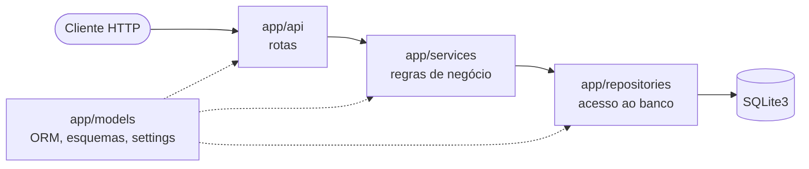

# laboratorio-projeto: micro-API de gestão de tarefas

> **Status:** em desenvolvimento. Estão concluídas as *releases* `v0.1.0` (fundação: documentação, dependências e arquitetura), `v0.2.0` (base técnica: configuração, banco, aplicação FastAPI e `GET /health`) e `v0.3.0` (CRUD de tarefas). Já funcionam criar, listar com filtro por *status*, consultar, atualizar, concluir e excluir tarefas. As regras de prioridade (`priority_advisor`) chegam na `v0.4.0`; até lá, a prioridade é só um campo validado de 1 a 4. As mudanças de cada *release* estão no [`CHANGELOG.md`](CHANGELOG.md).

Micro-API REST de gestão de tarefas (*To-Do List*) com prioridades, em Python, FastAPI e SQLite3. É o miniprojeto acadêmico do curso 1 da pós-graduação SWE-GENAI, que exige o uso de IA generativa em todo o ciclo de vida do software.

## Objetivo

Entregar um MVP pequeno, claro, funcional, bem testado e bem documentado, que um avaliador consiga clonar, instalar, executar e testar em uma máquina limpa.

### Escopo do MVP

- Criar, listar (com filtro por *status*), consultar, atualizar (total e parcial), marcar como concluída e excluir tarefas.
- Cada tarefa tem uma prioridade e pode ser **aberta** (sem data/hora) ou **específica** (com data/hora estipulada).
- *Health check* real da aplicação e do banco de dados (`/health`).
- Assessor de prioridade (`priority_advisor`) com regras determinísticas, sem IA. Por exemplo: verificar se a prioridade é coerente com a data/hora e sugerir uma prioridade pela proximidade do prazo.

Os requisitos funcionais e não funcionais, com critérios de aceitação, os itens fora de escopo e as decisões em aberto estão em [`docs/escopo-mvp.md`](docs/escopo-mvp.md).

### Prioridades

| Valor | Significado |
| --- | --- |
| 1 | Mandatória: fazer imediatamente |
| 2 | Importante: fazer hoje, se possível |
| 3 | Regular: fazer quando houver tempo |
| 4 | Agendada: fazer na data/hora estipulada |

Sem prioridade informada, a tarefa é criada com prioridade `3`.

## Stack

| Componente | Versão | Uso |
| --- | --- | --- |
| Python | 3.11+ (testado em 3.14.6) | linguagem |
| FastAPI | 0.142.2 | framework web e documentação OpenAPI |
| Starlette | 1.7.0 | base do FastAPI (dependência transitiva) |
| Uvicorn | 0.54.0 | servidor ASGI |
| SQLAlchemy | 2.1.3 | ORM (`Mapped` / `mapped_column`) |
| Pydantic | 2.13.5 | validação de dados |
| pydantic-settings | 2.15.0 | configuração por variáveis de ambiente |
| SQLite3 | embutido no Python | banco de dados |
| pytest | 9.1.1 | testes unitários e de integração |
| httpx2 | 2.13.1 | cliente HTTP do `TestClient` |
| mypy | 2.4.0 | checagem estática de tipos |
| Mermaid.js | renderizado pelo GitHub | diagramas de arquitetura |

As versões estão fixadas no [`requirements.txt`](requirements.txt), incluindo as dependências transitivas. Elas foram consultadas no PyPI em 03/10/2026. O Python 3.11 é o mínimo porque o SQLAlchemy 2.1 o exige.

## Arquitetura

API síncrona em camadas, uma por pacote em `app/`:



Os módulos e suas dependências, o fluxo de dados de `POST /tasks`, `GET /health` e dos erros em `/tasks/{id}`, o modelo de dados, a estratégia de testes e as decisões de arquitetura (ADRs) estão em [`docs/arquitetura.md`](docs/arquitetura.md). O histórico visual dos diagramas, com o antes e o depois de cada revisão, está em [`docs/mermaid.md`](docs/mermaid.md).

## Endpoints

Com a API em execução (ver [Como rodar localmente](#como-rodar-localmente)), todos os endpoints respondem em `http://127.0.0.1:8000` e trocam JSON. A documentação interativa gerada pelo FastAPI fica em `/docs`.

| Método e caminho | Descrição | Respostas |
| --- | --- | --- |
| `POST /tasks` | cria uma tarefa | `201` criada; `422` corpo inválido |
| `GET /tasks` | lista as tarefas por `id`; filtro opcional `?status=pending` ou `?status=done` | `200`; `422` *status* inválido |
| `GET /tasks/{id}` | consulta uma tarefa | `200`; `404` não existe; `422` `id` não numérico |
| `PUT /tasks/{id}` | substitui os cinco campos editáveis (todos obrigatórios) | `200`; `404`; `422` |
| `PATCH /tasks/{id}` | altera só os campos enviados | `200`; `404`; `422` |
| `POST /tasks/{id}/complete` | marca como concluída; repetir a chamada é permitido e devolve a mesma tarefa | `200`; `404`; `422` |
| `DELETE /tasks/{id}` | exclui a tarefa | `204` sem corpo; `404`; `422` |
| `GET /health` | verifica a aplicação e o banco de dados, com uma consulta real (`SELECT 1`) | `200` banco disponível; `503` banco indisponível |
| `GET /docs`, `GET /redoc`, `GET /openapi.json` | documentação interativa e esquema OpenAPI | `200` em `development` e `test`; `404` em `production` |

Qualquer endpoint de `/tasks` responde `500` com `{"detail": "Erro interno do servidor"}` se o banco falhar de forma inesperada; a causa vai para o log, nunca para a resposta.

### Tarefa

| Campo | Tipo | Em `POST` | Observação |
| --- | --- | --- | --- |
| `id` | inteiro | somente leitura | gerado pela API |
| `title` | texto, 1 a 200 caracteres | obrigatório | espaços nas pontas são removidos; título vazio ou só com espaços é rejeitado |
| `description` | texto de até 1000 caracteres, ou `null` | opcional | padrão `null` |
| `status` | `pending` ou `done` | opcional | padrão `pending` |
| `priority` | `1`, `2`, `3` ou `4` | opcional | padrão `3`; significados em [Prioridades](#prioridades) |
| `due_at` | data e hora ISO 8601 **com fuso horário**, ou `null` | opcional | `null` é tarefa aberta; com valor, é tarefa específica. A API devolve sempre em UTC |
| `created_at`, `updated_at` | data e hora em UTC | somente leitura | gerados pela API |

Campos desconhecidos ou somente leitura no corpo (`id`, `created_at`, `updated_at`) são rejeitados com `422`. No `PATCH`, `title`, `status` e `priority` não aceitam `null`; `description` e `due_at` aceitam `null` para limpar o valor.

### Erros

| Código | Quando | Corpo |
| --- | --- | --- |
| `404` | tarefa inexistente | `{"detail": "Tarefa não encontrada"}` |
| `422` | corpo, parâmetro de consulta ou `id` fora das regras de validação | `{"detail": [...]}`, uma entrada por campo inválido, com `loc` (onde), `msg` (o quê) e `input` (o valor recebido) |
| `500` | falha inesperada do banco | `{"detail": "Erro interno do servidor"}` |

### Exemplos de uso

Os exemplos foram executados contra a API em execução em 06/10/2026, nesta ordem, com o banco vazio. Os JSON mostrados são as respostas reais; o `id` e os instantes (`created_at`, `updated_at`) do seu teste serão outros. Em Bash, `curl -i` mostra a linha de *status*. Em PowerShell, `Invoke-RestMethod` converte o JSON da resposta em objeto; o texto JSON abaixo é o corpo enviado pela API.

Em PowerShell, `Invoke-RestMethod` lança exceção nas respostas de erro (`404`, `422`). Para ver o código e o corpo, use `try`/`catch`, como nos exemplos de erro abaixo (verificado no Windows PowerShell 5.1).

Os exemplos usam títulos sem acento. No Git Bash do Windows, `curl -d` com caracteres não ASCII na linha de comando foi rejeitado com `400 Bad Request` nesta máquina (página de código 850); enviar o corpo de um arquivo UTF-8 com `--data-binary @tarefa.json` funcionou.

#### `POST /tasks`: criar tarefa

Tarefa específica, com prazo e prioridade. O prazo enviado com `-03:00` volta convertido para UTC.

PowerShell:

```powershell
Invoke-RestMethod -Method Post -Uri http://127.0.0.1:8000/tasks -ContentType "application/json" -Body '{"title": "Entregar relatorio", "description": "Versao final em PDF", "priority": 2, "due_at": "2026-10-20T18:00:00-03:00"}'
```

Bash:

```bash
curl -i -X POST http://127.0.0.1:8000/tasks -H "Content-Type: application/json" -d '{"title": "Entregar relatorio", "description": "Versao final em PDF", "priority": 2, "due_at": "2026-10-20T18:00:00-03:00"}'
```

`201 Created`:

```json
{"id":1,"title":"Entregar relatorio","description":"Versao final em PDF","status":"pending","priority":2,"due_at":"2026-10-20T21:00:00Z","created_at":"2026-10-06T10:42:46.181149Z","updated_at":"2026-10-06T10:42:46.181149Z"}
```

Tarefa aberta, só com o título (prioridade `3`, `pending` e `due_at: null` por padrão):

PowerShell:

```powershell
Invoke-RestMethod -Method Post -Uri http://127.0.0.1:8000/tasks -ContentType "application/json" -Body '{"title": "Estudar FastAPI"}'
```

Bash:

```bash
curl -i -X POST http://127.0.0.1:8000/tasks -H "Content-Type: application/json" -d '{"title": "Estudar FastAPI"}'
```

`201 Created`:

```json
{"id":2,"title":"Estudar FastAPI","description":null,"status":"pending","priority":3,"due_at":null,"created_at":"2026-10-06T10:42:46.222476Z","updated_at":"2026-10-06T10:42:46.222476Z"}
```

**Caso `422`:** título só com espaços e prioridade fora de `1` a `4`.

PowerShell:

```powershell
try { Invoke-RestMethod -Method Post -Uri http://127.0.0.1:8000/tasks -ContentType "application/json" -Body '{"title": "   ", "priority": 9}' } catch { [int]$_.Exception.Response.StatusCode; $_.ErrorDetails.Message }
```

Bash:

```bash
curl -i -X POST http://127.0.0.1:8000/tasks -H "Content-Type: application/json" -d '{"title": "   ", "priority": 9}'
```

`422 Unprocessable Content`:

```json
{"detail":[{"type":"string_too_short","loc":["body","title"],"msg":"String should have at least 1 character","input":"   ","ctx":{"min_length":1}},{"type":"literal_error","loc":["body","priority"],"msg":"Input should be 1, 2, 3 or 4","input":9,"ctx":{"expected":"1, 2, 3 or 4"}}]}
```

#### `GET /tasks`: listar tarefas

PowerShell:

```powershell
Invoke-RestMethod http://127.0.0.1:8000/tasks
```

Bash:

```bash
curl -i http://127.0.0.1:8000/tasks
```

`200 OK`:

```json
[{"id":1,"title":"Entregar relatorio","description":"Versao final em PDF","status":"pending","priority":2,"due_at":"2026-10-20T21:00:00Z","created_at":"2026-10-06T10:42:46.181149Z","updated_at":"2026-10-06T10:42:46.181149Z"},{"id":2,"title":"Estudar FastAPI","description":null,"status":"pending","priority":3,"due_at":null,"created_at":"2026-10-06T10:42:46.222476Z","updated_at":"2026-10-06T10:42:46.222476Z"}]
```

Com filtro por *status*; nenhuma tarefa está concluída ainda, então a lista vem vazia:

PowerShell:

```powershell
Invoke-RestMethod "http://127.0.0.1:8000/tasks?status=done"
```

Bash:

```bash
curl -i "http://127.0.0.1:8000/tasks?status=done"
```

`200 OK`:

```json
[]
```

Um valor fora de `pending` e `done` (por exemplo, `?status=archived`) responde `422`:

```json
{"detail":[{"type":"literal_error","loc":["query","status"],"msg":"Input should be 'pending' or 'done'","input":"archived","ctx":{"expected":"'pending' or 'done'"}}]}
```

#### `GET /tasks/{id}`: consultar tarefa

PowerShell:

```powershell
Invoke-RestMethod http://127.0.0.1:8000/tasks/1
```

Bash:

```bash
curl -i http://127.0.0.1:8000/tasks/1
```

`200 OK`:

```json
{"id":1,"title":"Entregar relatorio","description":"Versao final em PDF","status":"pending","priority":2,"due_at":"2026-10-20T21:00:00Z","created_at":"2026-10-06T10:42:46.181149Z","updated_at":"2026-10-06T10:42:46.181149Z"}
```

**Caso `404`:** tarefa inexistente.

PowerShell:

```powershell
try { Invoke-RestMethod http://127.0.0.1:8000/tasks/999 } catch { [int]$_.Exception.Response.StatusCode; $_.ErrorDetails.Message }
```

Bash:

```bash
curl -i http://127.0.0.1:8000/tasks/999
```

`404 Not Found`:

```json
{"detail":"Tarefa não encontrada"}
```

#### `PUT /tasks/{id}`: substituir tarefa

Exige os cinco campos (`title`, `description`, `status`, `priority`, `due_at`), mesmo os que aceitam `null`.

PowerShell:

```powershell
Invoke-RestMethod -Method Put -Uri http://127.0.0.1:8000/tasks/2 -ContentType "application/json" -Body '{"title": "Estudar FastAPI e Pydantic", "description": null, "status": "pending", "priority": 1, "due_at": null}'
```

Bash:

```bash
curl -i -X PUT http://127.0.0.1:8000/tasks/2 -H "Content-Type: application/json" -d '{"title": "Estudar FastAPI e Pydantic", "description": null, "status": "pending", "priority": 1, "due_at": null}'
```

`200 OK`; `updated_at` avança e `created_at` permanece:

```json
{"id":2,"title":"Estudar FastAPI e Pydantic","description":null,"status":"pending","priority":1,"due_at":null,"created_at":"2026-10-06T10:42:46.222476Z","updated_at":"2026-10-06T10:42:59.996951Z"}
```

Enviar só `{"title": "Estudar FastAPI"}` responde `422` com uma entrada `missing` para cada um dos quatro campos ausentes (`description`, `status`, `priority`, `due_at`).

#### `PATCH /tasks/{id}`: alterar parcialmente

Altera a prioridade e limpa a descrição; os demais campos ficam como estão.

PowerShell:

```powershell
Invoke-RestMethod -Method Patch -Uri http://127.0.0.1:8000/tasks/1 -ContentType "application/json" -Body '{"priority": 1, "description": null}'
```

Bash:

```bash
curl -i -X PATCH http://127.0.0.1:8000/tasks/1 -H "Content-Type: application/json" -d '{"priority": 1, "description": null}'
```

`200 OK`:

```json
{"id":1,"title":"Entregar relatorio","description":null,"status":"pending","priority":1,"due_at":"2026-10-20T21:00:00Z","created_at":"2026-10-06T10:42:46.181149Z","updated_at":"2026-10-06T10:43:00.109887Z"}
```

Enviar `{"title": null}` responde `422` (`"msg":"Value error, o campo não aceita null"`).

#### `POST /tasks/{id}/complete`: concluir tarefa

Não tem corpo. Chamar de novo na tarefa já concluída responde `200` com a mesma tarefa, sem alterar `updated_at`.

PowerShell:

```powershell
Invoke-RestMethod -Method Post -Uri http://127.0.0.1:8000/tasks/1/complete
```

Bash:

```bash
curl -i -X POST http://127.0.0.1:8000/tasks/1/complete
```

`200 OK`:

```json
{"id":1,"title":"Entregar relatorio","description":null,"status":"done","priority":1,"due_at":"2026-10-20T21:00:00Z","created_at":"2026-10-06T10:42:46.181149Z","updated_at":"2026-10-06T10:43:00.211768Z"}
```

#### `DELETE /tasks/{id}`: excluir tarefa

PowerShell (a resposta `204` não tem corpo, então nada é exibido):

```powershell
Invoke-RestMethod -Method Delete -Uri http://127.0.0.1:8000/tasks/2
```

Bash:

```bash
curl -i -X DELETE http://127.0.0.1:8000/tasks/2
```

`204 No Content`, sem corpo. Repetir a chamada responde `404` com `{"detail":"Tarefa não encontrada"}`.

#### `GET /health`: saúde da aplicação e do banco

PowerShell:

```powershell
Invoke-RestMethod http://127.0.0.1:8000/health
```

Bash:

```bash
curl -i http://127.0.0.1:8000/health
```

Banco disponível, `200 OK`:

```json
{"status":"ok","database":"ok"}
```

Banco indisponível, `503 Service Unavailable`:

```json
{"status": "unavailable", "database": "unavailable"}
```

O corpo do `503` não traz mensagem de erro, SQL nem *stack trace*; o detalhe da falha vai para o log da aplicação. Os campos `status` e `database` aceitam só `ok` e `unavailable` (ADR-13 em [`docs/arquitetura.md`](docs/arquitetura.md)). O exemplo do `503` não foi obtido da API em execução: reproduz o contrato exercitado nos testes de integração, que simulam o banco indisponível.

## Configuração

Toda configuração vem de variáveis de ambiente, opcionalmente lidas de um arquivo `.env` na raiz do repositório. O `.env` não é versionado.

| Variável | Valores | Padrão | Descrição |
| --- | --- | --- | --- |
| `DATABASE_URL` | URL do SQLAlchemy | `sqlite:///./tasks.db` | banco de dados; cria o arquivo `tasks.db` na raiz |
| `ENVIRONMENT` | `development`, `test`, `production` | `development` | em `production`, a documentação interativa (`/docs`, `/redoc`) e o `/openapi.json` ficam desabilitados; valor fora do conjunto impede a inicialização da aplicação |

Exemplo de `.env`:

```dotenv
DATABASE_URL=sqlite:///./tasks.db
ENVIRONMENT=development
```

As configurações são lidas uma única vez, na partida da aplicação: para mudar um valor, reinicie o servidor. As tabelas são criadas na partida, se ainda não existirem.

## Como rodar localmente

Pré-requisitos: Python 3.11 ou superior e Git.

### 1. Clonar o repositório

```bash
git clone https://github.com/luisZsiqueira/laboratorio-projeto.git
cd laboratorio-projeto
```

### 2. Criar e ativar o ambiente virtual

PowerShell (Windows):

```powershell
python -m venv .venv
.\.venv\Scripts\Activate.ps1
```

Bash (Linux/macOS):

```bash
python3 -m venv .venv
source .venv/bin/activate
```

### 3. Instalar as dependências

```bash
python -m pip install -r requirements.txt
```

### 4. Rodar a API em desenvolvimento

```bash
python -m uvicorn app.main:app --reload
```

A API fica disponível em `http://127.0.0.1:8000`, e a documentação interativa em `http://127.0.0.1:8000/docs`. O log do *uvicorn* mostra `Application startup complete.` quando a aplicação está pronta; o primeiro início cria o arquivo `tasks.db` na raiz, que não é versionado. Para conferir, use o exemplo de [`GET /health`](#get-health-saúde-da-aplicação-e-do-banco).

### 5. Rodar os testes e a checagem de tipos

```bash
python -m pytest -W error
python -m mypy --explicit-package-bases app
```

Os testes usam SQLite em memória e não criam arquivos no repositório. Todos os comandos são executados a partir da raiz do repositório, com o `.venv` ativo. O `--explicit-package-bases` é necessário porque `app/` não tem `__init__.py` na raiz (ADR-03 e ADR-11 em [`docs/arquitetura.md`](docs/arquitetura.md)).

### Solução de problemas (Windows)

Se `import sqlalchemy` falhar com `DLL load failed while importing _immutabledict_cy` e a mensagem "Uma política de Controle de Aplicativo bloqueou este arquivo", o Smart App Control do Windows está bloqueando as extensões compiladas do SQLAlchemy, que não são assinadas. Reinstale a mesma versão em Python puro, com o `.venv` ativo:

```powershell
$env:DISABLE_SQLALCHEMY_CEXT="1"
python -m pip install --force-reinstall --no-deps --no-binary SQLAlchemy SQLAlchemy==2.1.3
Remove-Item Env:DISABLE_SQLALCHEMY_CEXT
```

A versão e o comportamento são os mesmos; só as otimizações em Cython ficam de fora.

## Roadmap de releases

Os itens de cada *release* (requisitos funcionais RF e técnicos RT), com critérios de aceite e estimativas, estão em [`docs/backlog.md`](docs/backlog.md).

| Release | Conteúdo | Situação |
| --- | --- | --- |
| `v0.1.0` | Fundação: estrutura, `.gitignore`, README, requisitos do curso, dependências verificadas, arquitetura e ADRs | concluída (04/10/2026, *tag* `v0.1.0`) |
| `v0.2.0` | Base técnica: configuração por ambiente, banco SQLite, aplicação FastAPI com `lifespan` e `/health` | concluída (05/10/2026, *tag* `v0.2.0`) |
| `v0.3.0` | CRUD de tarefas: criar, listar com filtro por *status*, consultar, atualizar (total e parcial), concluir e excluir | concluída (06/10/2026, *tag* `v0.3.0`) |
| `v0.4.0` | Prioridades e `priority_advisor` (regras determinísticas) | planejada |
| `v0.5.0` | Revisão da arquitetura, de segurança e da documentação | planejada |
| `v1.0.0` | Entrega do curso: validação em máquina limpa, histórico de uso de IA consolidado; marcada com *tag* e *release* `v1.0.0` no GitHub | planejada |

## Uso de IA generativa

O projeto é desenvolvido com apoio de IA generativa em todas as etapas do ciclo de vida: planejamento, arquitetura, código, testes e documentação.

| Assistente | Modelo | Etapas |
| --- | --- | --- |
| Claude (*chat*) | Claude Opus 5.5 | concepção do `CLAUDE.md` inicial a partir dos requisitos do curso, em 01 e 02/10/2026, antes do repositório |
| Claude Code | Claude Opus 5.5 | estrutura do projeto, `.gitignore`, README, verificação de versões e `requirements.txt`, desenho da arquitetura, licença, histórico de uso de IA, revisão de segredos e publicação no GitHub, revisão de publicação da `v0.1.0` (APIs deprecadas, ambiente virtual, *commits*, `CHANGELOG.md`), documento de escopo e requisitos do MVP, backlog por *release*, revisão dos diagramas Mermaid, regras de código e de *blueprint* executável |
| Claude in Chrome | Claude Opus 5.5 | conferência visual da renderização dos diagramas Mermaid no GitHub (Prompts 07 e 12) |
| Claude (*chat*) | Claude Sonnet 5.5 | extração, a partir de capturas de tela do curso, dos *prompts* de exemplo do tutor ([`docs/release-prompts-solon-020.md`](docs/release-prompts-solon-020.md)), em 04/10/2026 |
| Claude Code | Claude Fable 5.1 | planejamento dos *prompts* da fase de desenvolvimento ([`prompts/prompts-desenvolvimento.md`](prompts/prompts-desenvolvimento.md), Prompt 20) |
| Claude Code | Claude Sonnet 5.5 | execução do *blueprint* da `v0.2.0` ([`docs/blueprint-v020.md`](docs/blueprint-v020.md)): código da aplicação, testes de integração e execução manual da API (Prompts 22 e 23) |
| Claude Code | Claude Opus 5.5 | *blueprint* da `v0.2.0`, com protótipo verificado antes da aprovação (Prompt 21), e fechamento da *release*: revisão do README, ajuste dos diagramas, backlog, `CHANGELOG.md`, histórico de uso de IA e validação em clone limpo (Prompt 24) |
| Claude Code | Claude Opus 5.5 | *blueprint* da `v0.3.0` ([`docs/blueprint-v030.md`](docs/blueprint-v030.md)), com protótipo verificado e nova rodada do roteiro de APIs deprecadas (Prompt 25), e fechamento da *release* (Prompt 31) |
| Claude Code | Claude Sonnet 5.5 | execução do *blueprint* da `v0.3.0`: modelo, esquemas, *repository*, *service*, rotas, tradutores de erro e 56 testes novos (Prompts 26 a 29); exemplos de uso da seção Endpoints, executados na API (Prompt 30) |

- As regras de trabalho com o assistente estão em [`CLAUDE.md`](CLAUDE.md).
- Cada *prompt* usado fica registrado em [`prompts/`](prompts/), um arquivo por *prompt*; os *prompts* planejados para as *releases* `v0.2.0` a `v1.0.0` estão em [`prompts/prompts-desenvolvimento.md`](prompts/prompts-desenvolvimento.md).
- O histórico de uso da IA (etapas, ganhos, desafios) está em [`docs/HISTORY-IA.md`](docs/HISTORY-IA.md); o uso anterior ao repositório, em [`docs/PRE-HISTORY-IA.md`](docs/PRE-HISTORY-IA.md); o uso em modo *chat* fora do repositório, em [`docs/EXTRA-HISTORY-IA.md`](docs/EXTRA-HISTORY-IA.md).
- Os *blueprints* aprovados ([`docs/blueprint-v020.md`](docs/blueprint-v020.md) e [`docs/blueprint-v030.md`](docs/blueprint-v030.md)) são escritos para que um modelo de execução, como o Claude Sonnet 5.5, os siga sem depender do contexto da conversa (regra em [`CLAUDE.md`](CLAUDE.md), Blueprint executável).

Todo código gerado por IA é revisado e testado antes de ser incorporado.

## Limitações e próximos passos

Fora do escopo do MVP. São possibilidades futuras, não compromissos:

- autenticação e usuários;
- paginação na listagem;
- *frontend*;
- migrações de banco com Alembic;
- priorização assistida por IA (agente via API Claude).

O motivo de cada item ficar fora do MVP e os itens excluídos sem previsão estão em [`docs/escopo-mvp.md`](docs/escopo-mvp.md) (Fora de escopo).

## Créditos e licença

Desenvolvido por Luis Z Siqueira, com apoio do Claude Code, como miniprojeto do curso 1 da pós-graduação SWE-GENAI.

Distribuído sob a licença MIT. Veja o arquivo [`LICENSE`](LICENSE).
