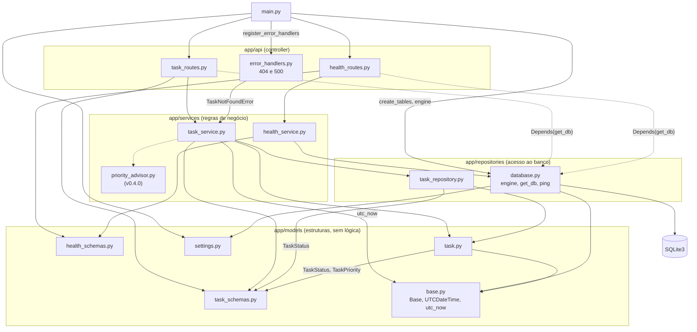
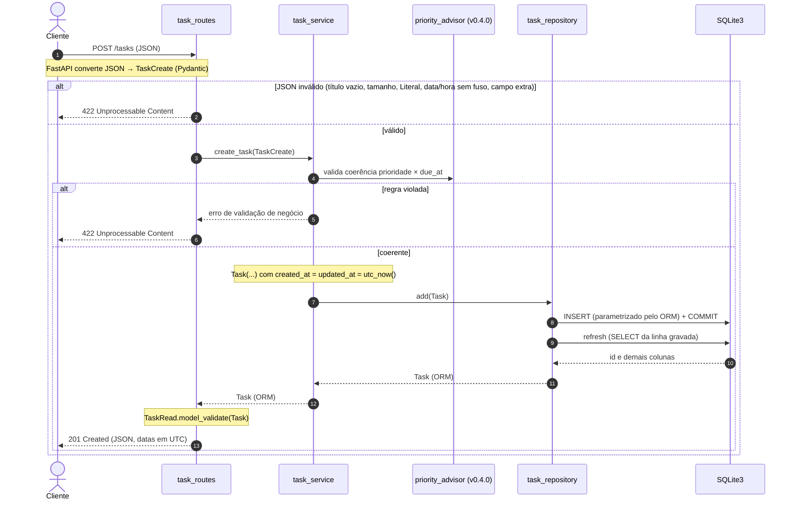
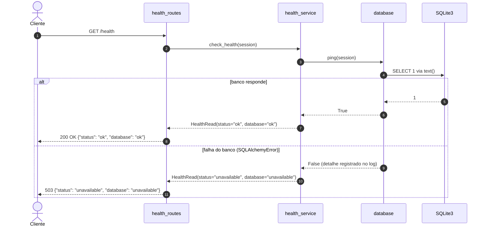
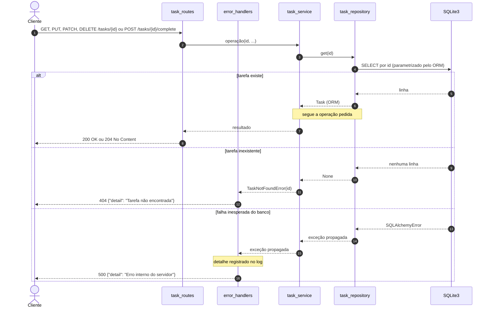
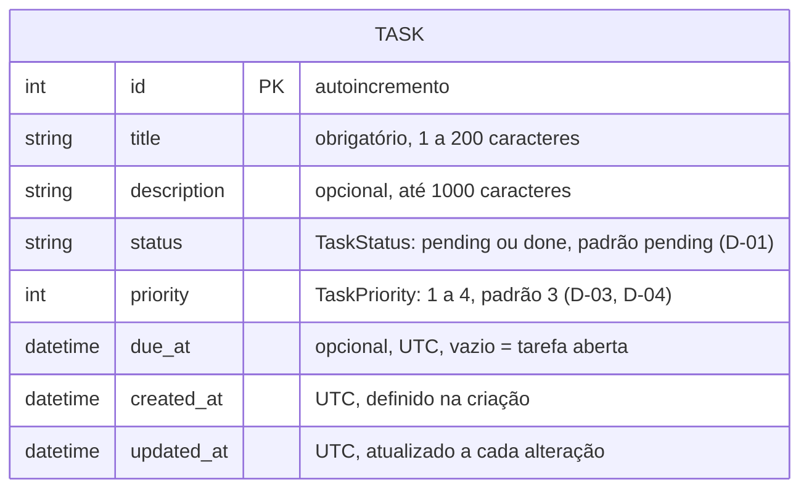
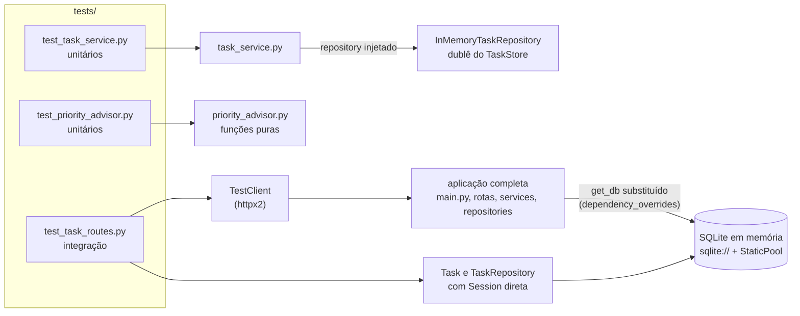

# Arquitetura

> **Status:** desenho aprovado na *release* `v0.1.0`, antes do código, diagramas revisados em 04/10/2026 (Prompt 12) e ajustados à implementação da `v0.2.0` em 05/10/2026 (Prompt 24) e da `v0.3.0` em 06/10/2026 (Prompt 31). Serve de *blueprint* para as *releases* `v0.2.0` a `v0.4.0` e será revisado na `v0.5.0`. Divergências da implementação são ajustadas pontualmente no fechamento de cada *release*. O histórico visual dos diagramas (antes e depois de cada revisão) está em [`docs/mermaid.md`](mermaid.md).

## 1. Visão geral

Micro-API REST síncrona em camadas, com uma camada por pacote em `app/`:

| Camada | Pacote | Responsabilidade | Não pode |
| --- | --- | --- | --- |
| Controller | `app/api/` | rotas HTTP, códigos de resposta, injeção de dependências | acessar o banco ou conter regra de negócio |
| Service | `app/services/` | regras de negócio, incluindo o `priority_advisor` | conhecer HTTP |
| Repository | `app/repositories/` | *engine*, sessão e consultas; único ponto de acesso ao banco | conter regra de negócio |
| Models | `app/models/` | modelos ORM, esquemas Pydantic e configurações | conter lógica |
| Composição | `app/main.py` | criação da aplicação, `lifespan` e registro das rotas | conter qualquer outra coisa |

Dependências apontam sempre para baixo: Controller → Service → Repository → SQLite3. Os modelos são usados por todas as camadas.

## 2. Módulos e dependências

Cada seta significa "importa". A seta pontilhada indica que as rotas recebem a sessão do banco por `Depends(get_db)` e apenas a repassam ao *service*: **as rotas não fazem consultas**.

Correspondência com os nomes genéricos: *config* = `settings.py`; *schemas* = `task_schemas.py` e `health_schemas.py`; *models* = `task.py` e `base.py`; *repository* = `task_repository.py`; *service* = `task_service.py`; *routes* = `task_routes.py` e `health_routes.py`.

Observações:

- `main.py` importa de `database.py` só `create_tables` (chamada no `lifespan`, que executa `Base.metadata.create_all`) e o `engine`, e de `settings.py` as configurações que desabilitam a documentação em produção. A aplicação é montada pela fábrica `create_app(settings, db_engine)`, e `app = create_app(get_settings(), engine)` fica no nível do módulo; os testes criam a aplicação com `Settings` e *engine* próprios (DT-01 em [`docs/decisoes.md`](decisoes.md)).
- `health_schemas.py` define `HealthStatus` (`Literal["ok", "unavailable"]`) e o modelo `HealthRead`, devolvido pelo `health_service` e usado como `response_model` pela rota (ADR-13).
- `priority_advisor.py` contém funções puras: não importa repositório, banco nem HTTP. Entra na `v0.4.0`; a seta pontilhada `task_service → priority_advisor` é a dependência prevista.
- `task_schemas.py` define os tipos `TaskStatus` e `TaskPriority` (`typing.Literal`), usados também pelo modelo `Task` (anotações das colunas), pelo *repository* (filtro por *status*) e pelo *service*.
- `task_service.py` importa `task.py` porque converte o esquema de entrada no objeto ORM `Task` que entrega ao *repository*, e `base.py` pela função `utc_now()`, que dá o mesmo instante a `created_at` e `updated_at` na criação (DT-06). Ele importa `task_repository.py` só em `build_task_service(session)`, a composição usada pela rota; os casos de uso dependem do protocolo `TaskStore` (ADR-14).
- `base.py` contém, além do `Base`, o tipo de coluna `UTCDateTime`, que grava as datas em UTC e as devolve *timezone-aware* (DT-04), e a função `utc_now()`.
- `error_handlers.py` traduz `TaskNotFoundError` em `404` e `SQLAlchemyError` em `500` com mensagem genérica (ADR-15); é registrado na aplicação por `main.py`, não em um *router*. Por isso as rotas não capturam exceções.

## 3. Fluxo de dados

### POST /tasks

O corpo JSON é validado pelo FastAPI no esquema Pydantic antes de chegar à rota. A rota recebe o *service* já composto com o *repository* da sessão da requisição (`Depends(get_task_service)`, ADR-14). O *service* converte o esquema num objeto ORM, com `created_at` e `updated_at` no mesmo instante (DT-06), e o entrega ao *repository*, que o grava no SQLite, confirma a transação e recarrega a linha para obter o `id` gerado pelo banco (ADR-12). A rota converte o objeto ORM no esquema de saída com `TaskRead.model_validate` (`from_attributes`), e o FastAPI o serializa em JSON, com as datas em UTC (DT-04). A validação de coerência pelo `priority_advisor` entra na `v0.4.0`.

### GET /health

### Erros em /tasks/{id}

Vale para `GET`, `PUT`, `PATCH` e `DELETE /tasks/{id}` e para `POST /tasks/{id}/complete`. O corpo inválido e o `id` não numérico (422) seguem o fluxo de `POST /tasks`. As rotas não capturam exceções: os tradutores de `app/api/error_handlers.py`, registrados na aplicação, convertem a exceção em resposta HTTP (ADR-15).

- **404 Not Found:** `GET`, `PUT`, `PATCH` e `DELETE /tasks/{id}` e `POST /tasks/{id}/complete` respondem 404 quando o *repository* não encontra a tarefa. O *service* levanta `TaskNotFoundError`, e o tradutor registrado na aplicação a converte em 404, sem o `id` no corpo; o *service* não conhece códigos HTTP.
- **500 Internal Server Error:** falha inesperada do banco (`SQLAlchemyError`) em operações de tarefa responde com mensagem genérica; o detalhe vai para o log (`app.api.error_handlers`), nunca para o cliente.
- **Conclusão idempotente (D-02):** se a tarefa já estiver concluída, o *service* a devolve sem gravar, e `updated_at` não muda.

## 4. Modelo de dados

Uma única entidade, persistida na tabela `tasks`.

- Atributos e regras conforme [`docs/escopo-mvp.md`](escopo-mvp.md), seção 2.1. O modelo ORM é `Task`, em `app/models/task.py`.
- Tarefa **aberta**: `due_at` vazio. Tarefa **específica**: `due_at` preenchido.
- Prioridades: 1 = mandatória, 2 = importante, 3 = regular, 4 = agendada (na data/hora estipulada). A coluna existe desde a `v0.3.0` (D-03); as regras de coerência com `due_at` entram na `v0.4.0`.
- O padrão de `status` e `priority` é aplicado pelo esquema de entrada (`TaskCreate`), não pela coluna.
- As três colunas de data usam o tipo `UTCDateTime` (DT-04): o SQLite guarda o valor em UTC, sem fuso, e a leitura o devolve com `tzinfo=UTC`. Data/hora sem fuso é recusada na entrada da API (`422`) e na gravação.
- Decisões em aberto para o *blueprint* da `v0.4.0` (coerência entre prioridade 4 e `due_at`, filtro por prioridade, regras do `priority_advisor`): ver [`docs/escopo-mvp.md`](escopo-mvp.md), seção 6.

## 5. Testes

Cada arquivo de teste exercita uma parte da aplicação, com o mínimo de infraestrutura. Não há `conftest.py`: cada fixture fica no arquivo que a usa.

- Os unitários não abrem banco nem HTTP. O `priority_advisor` recebe a data/hora de referência como parâmetro, para resultados determinísticos.
- A integração cobre todos os endpoints, incluindo `/health` com banco indisponível e a documentação com `ENVIRONMENT=production`. A fixture chama `engine.dispose()` ao final (ADR-06).
- O `503` de `/health` e o fechamento da sessão em `get_db` são testados com dublês simples de sessão (`FailingSession` e `SessionSpy`), sem biblioteca de *mock* (DT-03 em [`docs/decisoes.md`](decisoes.md)).
- O *service* recebe o dublê `InMemoryTaskRepository` por injeção (ADR-14); o contador `save_count` prova a idempotência da conclusão (DT-07).
- `test_task_routes.py` também testa o modelo `Task` (datas em UTC) e o `TaskRepository` com uma `Session` direta sobre o banco em memória, sem HTTP. O `500` é provocado com um banco em memória sem a tabela `tasks`, e a mudança de `updated_at` é conferida a partir de um valor antigo gravado direto no banco (DT-08).
- `test_priority_advisor.py` entra na `v0.4.0`. Na `v0.3.0` são 69 testes: 55 em `test_task_routes.py` (contando os casos parametrizados) e 14 em `test_task_service.py`.

## 6. Decisões de arquitetura

| # | Decisão | Motivo |
| --- | --- | --- |
| ADR-01 | Camadas Controller → Service → Repository, um pacote por camada | separa HTTP, regra de negócio e persistência; permite testar o *service* com um dublê do *repository* |
| ADR-02 | `Base` declarativo (`class Base(DeclarativeBase)`) em `app/models/base.py`, importado pelos modelos e por `database.py` | evita ciclo de importação entre modelos e *engine* |
| ADR-03 | `app/` sem `__init__.py` na raiz (pacote de *namespace*); comandos executados da raiz via `python -m` | o `python -m` coloca a raiz no `sys.path`, e os testes importam `app` sem `conftest.py` nem arquivo de configuração |
| ADR-04 | SQLite com `connect_args={"check_same_thread": False}` | rotas síncronas rodam no *pool* de *threads* do FastAPI; a sessão é criada e fechada por requisição em `get_db` |
| ADR-05 | Tabelas criadas com `Base.metadata.create_all` no `lifespan` de `app/main.py` | o MVP não tem migrações (Alembic está fora do escopo); `lifespan` substitui o `on_event` legado |
| ADR-06 | Testes com `sqlite://` e `StaticPool`; fixtures chamam `engine.dispose()` | banco em memória compartilhado entre conexões, sem arquivos no repositório e sem aviso de recurso aberto com `-W error` |
| ADR-07 | `/health` segue `health_routes` → `health_service` → `database.ping()`, que executa `SELECT 1` via `text()`; responde 503 se o banco falhar | verificação real do banco, respeitando as camadas; `ping` fica em `database.py` porque não pertence a nenhuma entidade |
| ADR-08 | Documentação interativa (`/docs`, `/redoc`, `/openapi.json`) desabilitada com `ENVIRONMENT=production` | não expor a superfície da API em produção |
| ADR-09 | `httpx2` como cliente HTTP do `TestClient` | o Starlette 1.7.0 o exige; o uso de `httpx` emite aviso de deprecação, que falha com `-W error` |
| ADR-10 | Datas *timezone-aware* em UTC nos esquemas e na persistência | o SQLite não guarda fuso horário; a conversão para UTC na leitura e na escrita fica na camada de modelos/*repository* e é coberta por testes |
| ADR-11 | Checagem de tipos com `python -m mypy --explicit-package-bases app` | com `app/` sem `__init__.py` (ADR-03), `mypy app` acusa o mesmo arquivo sob dois nomes de módulo (`models.x` e `app.models.x`); a opção faz o mypy derivar o nome do módulo a partir da raiz. Verificado no mypy 2.4.0 em 04/10/2026 |
| ADR-12 | Operações de escrita confirmadas no *repository* (`commit` seguido de `refresh`); `get_db` só abre e fecha a sessão | mantém a persistência num único ponto; o `refresh` devolve os valores gerados pelo banco (`id`, datas); uma sessão fechada sem `commit` descarta alterações pendentes de uma requisição que falhou. Decidido na revisão dos diagramas (Prompt 12), em 04/10/2026 |
| ADR-13 | Contrato de `GET /health` (D-08): modelo `HealthRead` em `app/models/health_schemas.py`, com `status` e `database` do tipo `HealthStatus = Literal["ok", "unavailable"]`. Banco disponível: `200` com `{"status": "ok", "database": "ok"}`; banco indisponível: `503` com `{"status": "unavailable", "database": "unavailable"}` | o corpo não traz mensagem de erro, nome de exceção nem SQL (detalhes só no log, ADR-07); o esquema fica separado dos de tarefa. Decidido no *blueprint* da `v0.2.0` ([`blueprint-v020.md`](blueprint-v020.md)), em 05/10/2026 |
| ADR-14 | O *service* recebe o *repository* por injeção: `TaskService(repository: TaskStore)`, com `TaskStore` (`typing.Protocol`) definido em `task_service.py` e satisfeito estruturalmente por `TaskRepository`. A composição real fica em `build_task_service(session)`, no próprio *service*; a rota só declara `Depends(get_task_service)` | permite os testes unitários do *service* com um dublê simples, sem banco e sem *mock* (`CLAUDE.md`, Testes); a rota continua sem acesso ao banco. Decidido no *blueprint* da `v0.3.0` ([`blueprint-v030.md`](blueprint-v030.md)), em 05/10/2026 |
| ADR-15 | Contrato dos endpoints de tarefa: rotas e códigos de `POST/GET /tasks` e `GET/PUT/PATCH/DELETE /tasks/{task_id}`, mais `POST /tasks/{task_id}/complete` (idempotente, `200`), como em [`blueprint-v030.md`](blueprint-v030.md), seção 4; corpo de erro `{"detail": "Tarefa não encontrada"}` no `404` e `{"detail": "Erro interno do servidor"}` no `500`; `422` no formato padrão do FastAPI; campos desconhecidos ou somente leitura (`id`, `created_at`, `updated_at`) na entrada respondem `422` (`extra="forbid"`); `due_at` exige fuso horário (sem fuso: `422`) e é devolvido em UTC com sufixo `Z`; listagem em ordem crescente de `id` | contrato estável e testável; rejeitar em vez de ignorar evita que o cliente pense ter alterado um campo somente leitura; os tradutores de exceção ficam em `app/api/error_handlers.py` e a mensagem de erro nunca traz detalhe interno. Decidido no *blueprint* da `v0.3.0`, em 05/10/2026 |
