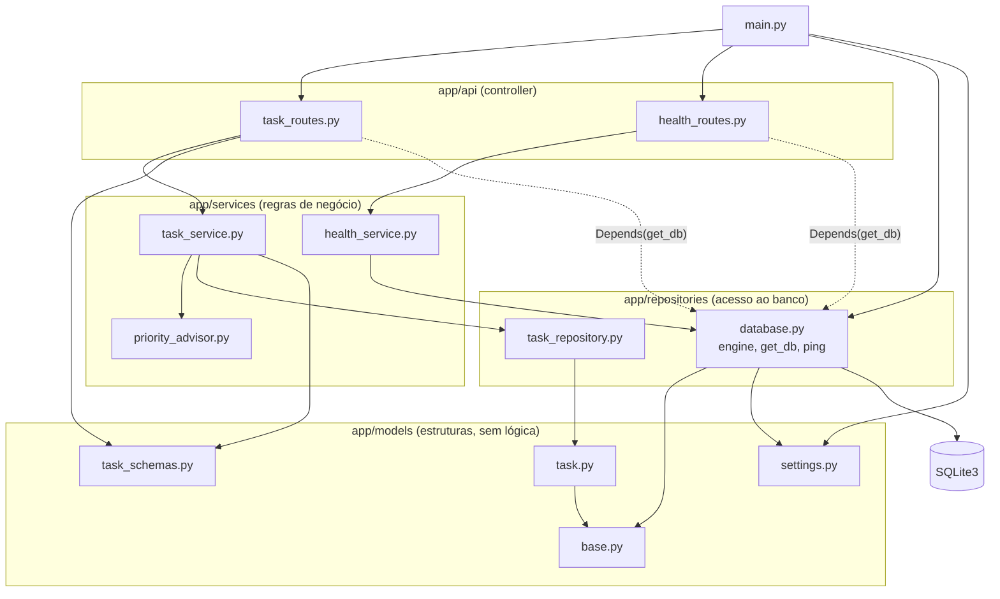
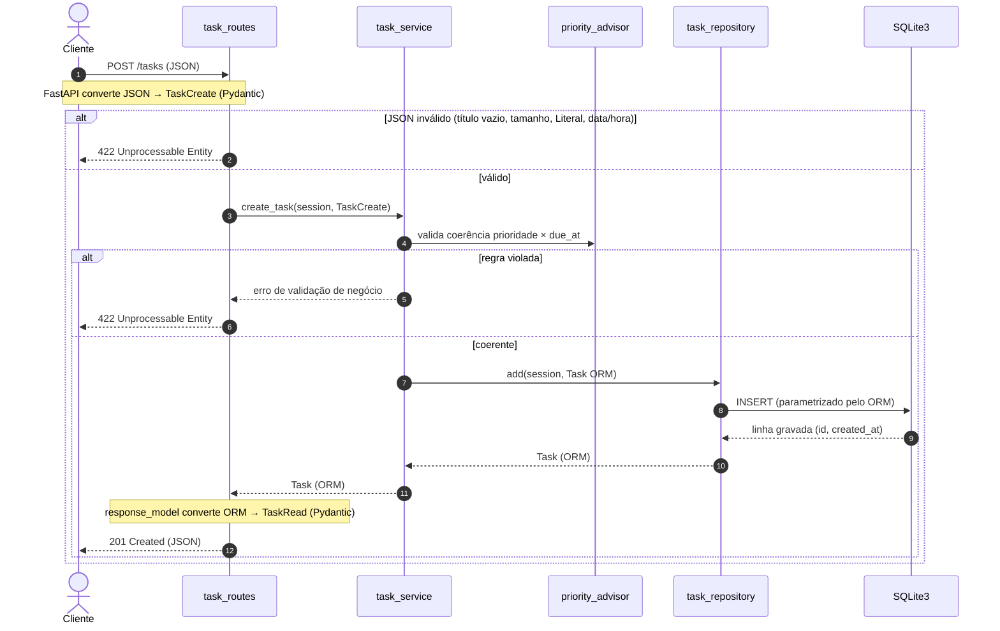
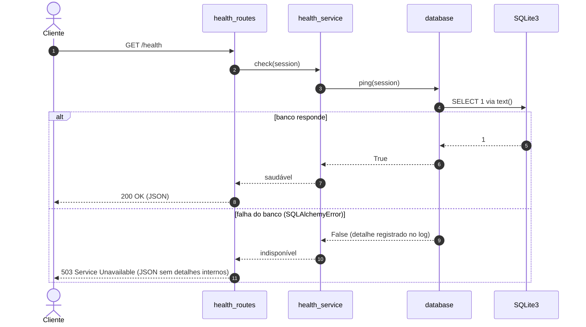
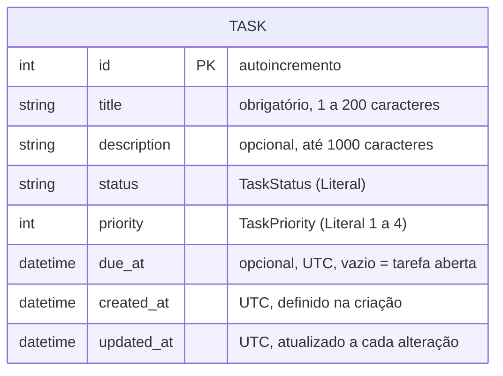

# Arquitetura

> **Status:** desenho aprovado na *release* `v0.1.0`, antes do código. Serve de *blueprint* para as *releases* `v0.2.0` a `v0.4.0` e será revisado na `v0.5.0`. Divergências da implementação são ajustadas pontualmente no fechamento de cada *release*.

## 1. Visão geral

Micro-API REST síncrona em camadas, com uma camada por pacote em `app/`:

| Camada | Pacote | Responsabilidade | Não pode |
| --- | --- | --- | --- |
| Controller | `app/api/` | rotas HTTP, códigos de resposta, injeção de dependências | acessar o banco ou conter regra de negócio |
| Service | `app/services/` | regras de negócio, incluindo o `priority_advisor` | conhecer HTTP |
| Repository | `app/repositories/` | *engine*, sessão e consultas; único ponto de acesso ao banco | conter regra de negócio |
| Models | `app/models/` | modelos ORM, esquemas Pydantic e configurações | conter lógica |
| Composição | `app/main.py` | criação da aplicação, `lifespan` e registro das rotas | conter qualquer outra coisa |

Dependências apontam sempre para baixo: Controller → Service → Repository → SQLite3. Os modelos são usados por todas as camadas.

## 2. Módulos e dependências

Cada seta significa "importa". A seta pontilhada indica que as rotas recebem a sessão do banco por `Depends(get_db)` e apenas a repassam ao *service*: **as rotas não fazem consultas**.

Correspondência com os nomes genéricos: *config* = `settings.py`; *schemas* = `task_schemas.py`; *models* = `task.py` e `base.py`; *repository* = `task_repository.py`; *service* = `task_service.py`; *routes* = `task_routes.py` e `health_routes.py`.

Observações:

- `main.py` importa `database.py` só para criar as tabelas (`Base.metadata.create_all`) no `lifespan`, e `settings.py` para desabilitar a documentação em produção.
- `priority_advisor.py` contém funções puras: não importa repositório, banco nem HTTP.
- `task_schemas.py` define os tipos `TaskStatus` e `TaskPriority` (`typing.Literal`) usados também pelo *service*.

## 3. Fluxo de dados

### POST /tasks

O corpo JSON é validado pelo FastAPI no esquema Pydantic antes de chegar à rota. O *service* recebe o esquema, aplica as regras de prioridade e entrega ao *repository* um objeto ORM, que o grava no SQLite. A resposta volta como objeto ORM e é convertida para o esquema de saída (`from_attributes`) e serializada em JSON.

### GET /health

### Outros códigos de resposta

- **404 Not Found:** `GET`, `PUT`, `PATCH` e `DELETE /tasks/{id}` (e a marcação como concluída) respondem 404 quando o *repository* não encontra a tarefa. O *service* sinaliza com uma exceção de domínio, e a rota a traduz para 404; o *service* não conhece códigos HTTP.
- **500 Internal Server Error:** falha inesperada do banco em operações de tarefa responde com mensagem genérica; o detalhe vai para o log, nunca para o cliente.

## 4. Modelo de dados

Uma única entidade, persistida na tabela `tasks`.

- Tarefa **aberta**: `due_at` vazio. Tarefa **específica**: `due_at` preenchido.
- Prioridades: 1 = mandatória, 2 = importante, 3 = regular, 4 = agendada (na data/hora estipulada).
- Decisões em aberto para o *blueprint* da `v0.3.0`/`v0.4.0`: valores de `TaskStatus` (recomendação: `pending`, `done`); prioridade padrão (recomendação: 3); se prioridade 4 exige `due_at` e vice-versa; filtro por prioridade; regras do `priority_advisor`.

## 5. Decisões de arquitetura

| # | Decisão | Motivo |
| --- | --- | --- |
| ADR-01 | Camadas Controller → Service → Repository, um pacote por camada | separa HTTP, regra de negócio e persistência; permite testar o *service* com um dublê do *repository* |
| ADR-02 | `Base` declarativo (`class Base(DeclarativeBase)`) em `app/models/base.py`, importado pelos modelos e por `database.py` | evita ciclo de importação entre modelos e *engine* |
| ADR-03 | `app/` sem `__init__.py` na raiz (pacote de *namespace*); comandos executados da raiz via `python -m` | o `python -m` coloca a raiz no `sys.path`, e os testes importam `app` sem `conftest.py` nem arquivo de configuração |
| ADR-04 | SQLite com `connect_args={"check_same_thread": False}` | rotas síncronas rodam no *pool* de *threads* do FastAPI; a sessão é criada e fechada por requisição em `get_db` |
| ADR-05 | Tabelas criadas com `Base.metadata.create_all` no `lifespan` de `app/main.py` | o MVP não tem migrações (Alembic está fora do escopo); `lifespan` substitui o `on_event` legado |
| ADR-06 | Testes com `sqlite://` e `StaticPool`; fixtures chamam `engine.dispose()` | banco em memória compartilhado entre conexões, sem arquivos no repositório e sem aviso de recurso aberto com `-W error` |
| ADR-07 | `/health` segue `health_routes` → `health_service` → `database.ping()`, que executa `SELECT 1` via `text()`; responde 503 se o banco falhar | verificação real do banco, respeitando as camadas; `ping` fica em `database.py` porque não pertence a nenhuma entidade |
| ADR-08 | Documentação interativa (`/docs`, `/redoc`, `/openapi.json`) desabilitada com `ENVIRONMENT=production` | não expor a superfície da API em produção |
| ADR-09 | `httpx2` como cliente HTTP do `TestClient` | o Starlette 1.7.0 o exige; o uso de `httpx` emite aviso de deprecação, que falha com `-W error` |
| ADR-10 | Datas *timezone-aware* em UTC nos esquemas e na persistência | o SQLite não guarda fuso horário; a conversão para UTC na leitura e na escrita fica na camada de modelos/*repository* e é coberta por testes |
| ADR-11 | Checagem de tipos com `python -m mypy --explicit-package-bases app` | com `app/` sem `__init__.py` (ADR-03), `mypy app` acusa o mesmo arquivo sob dois nomes de módulo (`models.x` e `app.models.x`); a opção faz o mypy derivar o nome do módulo a partir da raiz. Verificado no mypy 2.4.0 em 04/10/2026 |
