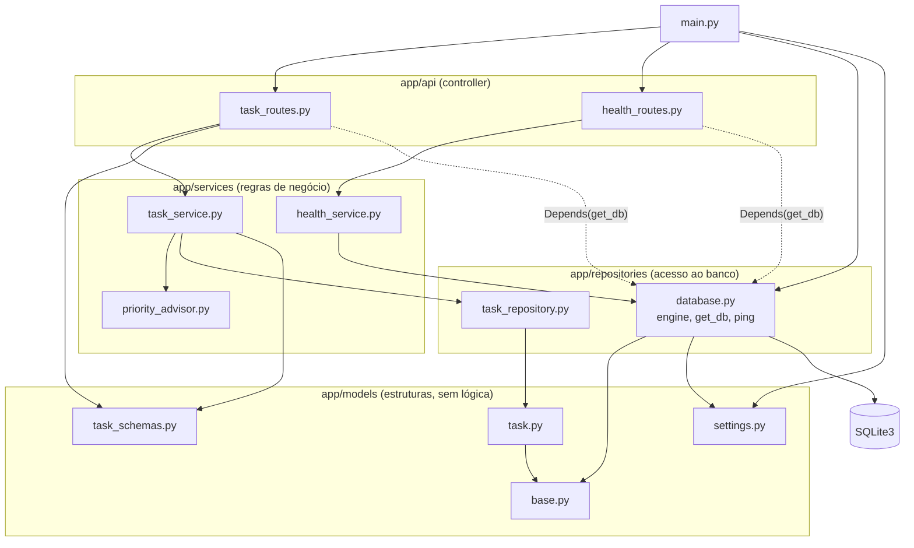
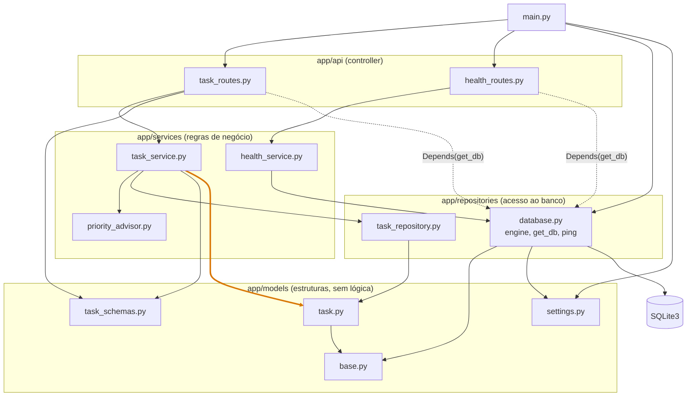
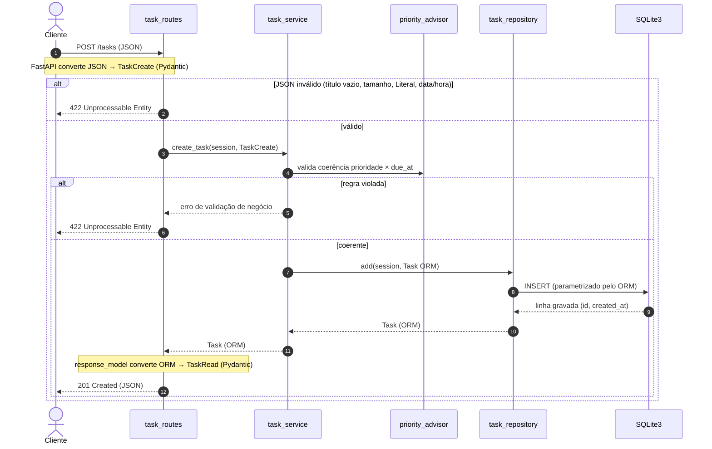
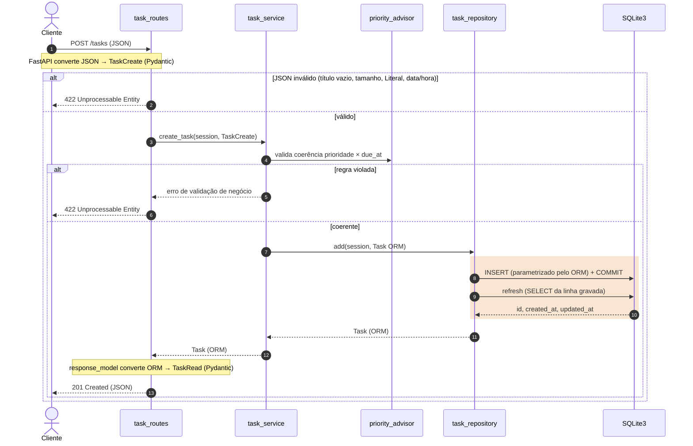
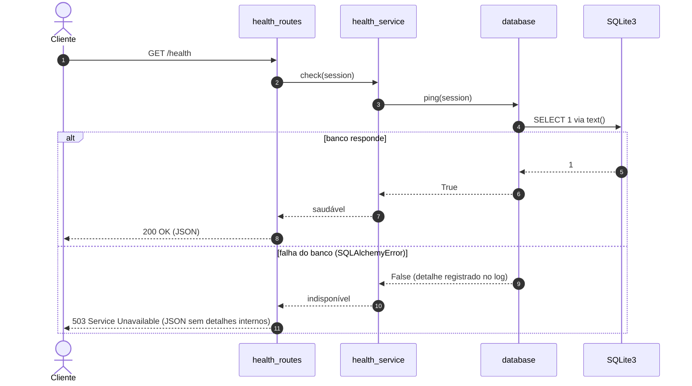
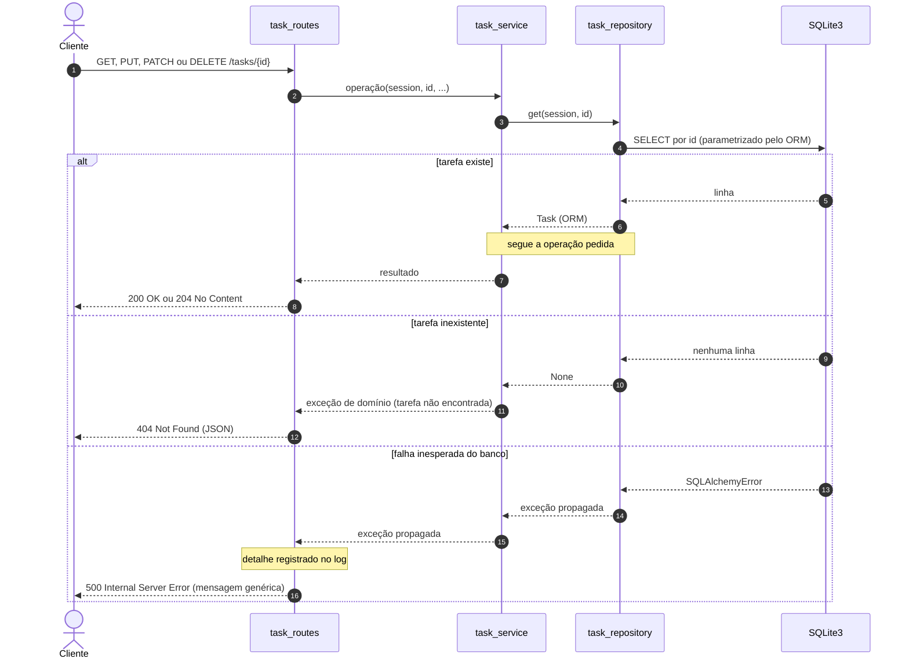
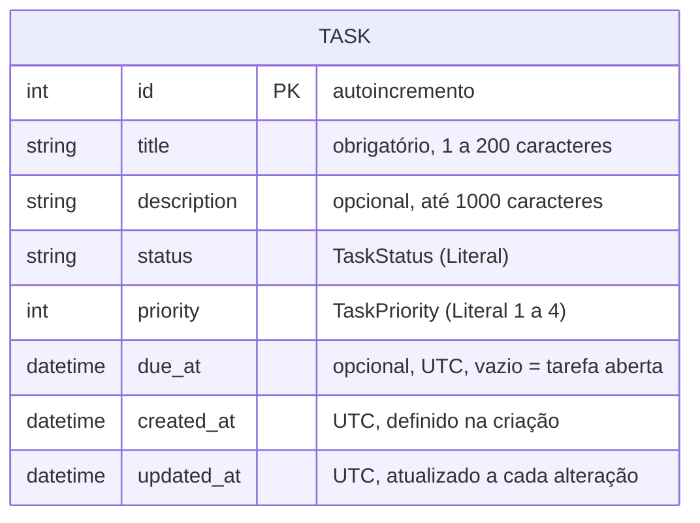
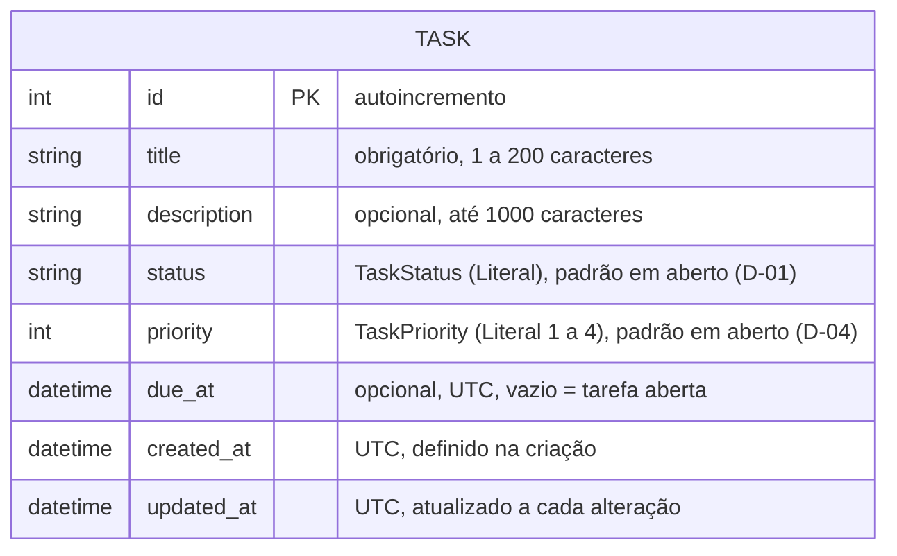
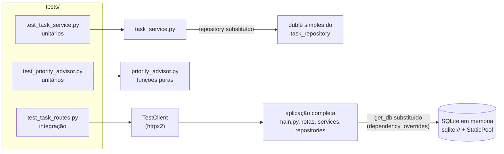

# Diagramas Mermaid

> **Status:** catálogo criado na revisão dos diagramas de 04/10/2026 (Prompt 12). A cada nova revisão, acrescentar uma seção com o antes e o depois.

Este arquivo é o histórico visual dos diagramas do projeto: mostra cada diagrama **antes** e **depois** de uma revisão, com o que mudou e por quê. A versão oficial de cada diagrama continua no arquivo de origem, indicado em cada item: [`docs/arquitetura.md`](arquitetura.md) ou o [`README.md`](../README.md). Quem altera um diagrama atualiza os dois lugares (regra do [`CLAUDE.md`](../CLAUDE.md)).

## Como ler

- **Antes:** o diagrama como estava no *commit* `885d036`, publicado com a *release* `v0.1.0`.
- **Depois:** o diagrama revisado, com as mudanças **destacadas em laranja**: arestas mais grossas (`linkStyle`) nos fluxogramas e faixas coloridas (`rect`) nos diagramas de sequência. O destaque existe só neste arquivo; a versão oficial não o tem.
- Diagramas sem alteração aparecem uma vez, com o motivo de terem sido mantidos.
- A sintaxe é renderizada pelo próprio GitHub, sem dependência de Node.js.

## Revisão de 04/10/2026 (Prompt 12)

Os diagramas foram comparados com o `CLAUDE.md`, os ADRs, o [`docs/escopo-mvp.md`](escopo-mvp.md) e o [`docs/backlog.md`](backlog.md).

| # | Diagrama | Origem | Resultado | Motivo |
| --- | --- | --- | --- | --- |
| 1 | Visão em camadas | README (Arquitetura) | sem alteração | continua correto como resumo |
| 2 | Módulos e dependências | `arquitetura.md`, seção 2 | **alterado** | faltava a dependência `task_service → task` |
| 3 | Fluxo de `POST /tasks` | `arquitetura.md`, seção 3 | **alterado** | não mostrava quem confirma a transação; gerou a ADR-12 |
| 4 | Fluxo de `GET /health` | `arquitetura.md`, seção 3 | sem alteração | o esquema da resposta ficou como decisão D-08, para o *blueprint* da `v0.2.0` |
| 5 | Erros em `/tasks/{id}` | `arquitetura.md`, seção 3 | **novo** | 404 e 500 só existiam em texto |
| 6 | Modelo de dados | `arquitetura.md`, seção 4 | **alterado** | padrões de `status` e `priority` ligados às decisões em aberto |
| 7 | Testes | `arquitetura.md`, seção 5 | **novo** | a estratégia de testes não tinha representação visual |

Itens avaliados e não feitos:

- **Diagrama de estados do `TaskStatus`:** depende da decisão D-01 (valores de *status*); fica para o *blueprint* da `v0.3.0`.
- **Roadmap em `gantt` ou `timeline`:** as *releases* não têm datas planejadas; o diagrama repetiria a tabela do README e dobraria a manutenção.
- **Esquema da resposta de `/health`:** por decisão do autor, fica para o *blueprint* da `v0.2.0` (D-08 no escopo). O diagrama 2 será atualizado quando a decisão for tomada.

### 1. Visão em camadas (README): sem alteração

### 2. Módulos e dependências: alterado

**O que mudou:** acrescentada a aresta `task_service --> task`.

**Por quê:** o fluxo de `POST /tasks` diz que o *service* converte o esquema de entrada no objeto ORM `Task` e o entrega ao *repository*. Para isso, `task_service.py` precisa importar `task.py`. O diagrama anterior escondia essa dependência, e quem implementasse seguindo só o desenho não teria onde criar o objeto ORM sem violar as camadas.

**Antes**

**Depois** (aresta nova em laranja)

### 3. Fluxo de `POST /tasks`: alterado

**O que mudou:** a gravação passou de uma mensagem (`INSERT`) para três: `INSERT + COMMIT`, `refresh` e o retorno de `id`, `created_at` e `updated_at`.

**Por quê:** o desenho anterior não dizia quem confirma a transação nem como os valores gerados pelo banco voltam ao objeto. Sem isso, cada camada poderia supor que a outra faz o `commit`. A decisão foi registrada como **ADR-12**: o *repository* faz `commit` seguido de `refresh`; o `get_db` só abre e fecha a sessão.

**Antes**

**Depois** (trecho novo na faixa laranja)

### 4. Fluxo de `GET /health`: sem alteração

O fluxo continua correto: verificação real com `SELECT 1`, 200 ou 503 e nenhum detalhe interno na resposta. O esquema Pydantic do corpo da resposta ficou como decisão D-08, para o *blueprint* da `v0.2.0`.

### 5. Erros em `/tasks/{id}`: novo

**Antes:** não havia diagrama. O comportamento estava só em texto, na seção "Outros códigos de resposta" de `docs/arquitetura.md`:

> - **404 Not Found:** `GET`, `PUT`, `PATCH` e `DELETE /tasks/{id}` (e a marcação como concluída) respondem 404 quando o *repository* não encontra a tarefa. O *service* sinaliza com uma exceção de domínio, e a rota a traduz para 404; o *service* não conhece códigos HTTP.
> - **500 Internal Server Error:** falha inesperada do banco em operações de tarefa responde com mensagem genérica; o detalhe vai para o log, nunca para o cliente.

**Por quê:** os três desfechos de uma operação sobre uma tarefa (existe, não existe, banco falhou) são o núcleo dos RF-04 a RF-08 e do RT-09. Vê-los lado a lado deixa claro onde está a exceção de domínio e que o 500 não expõe detalhes internos (RNF-10). O diagrama não fixa onde o erro é registrado no log; isso fica para o *blueprint* da `v0.3.0` (RT-09).

**Depois**

### 6. Modelo de dados: alterado

**O que mudou:** os comentários de `status` e `priority` passaram a indicar que o valor padrão está em aberto (decisões D-01 e D-04), e o texto abaixo do diagrama de origem passou a citar a seção 2.1 do escopo. A estrutura da tabela não mudou.

**Por quê:** o diagrama anterior não dizia nada sobre valores padrão, e quem o lesse poderia supor que não há. Ligar os campos às decisões evita implementar um padrão antes de ele ser aprovado.

**Antes**

**Depois** (as mudanças estão nos comentários de `status` e `priority`; o `erDiagram` não permite destaque de cor por atributo)

### 7. Testes: novo

**Antes:** não havia diagrama. A estratégia estava só no `CLAUDE.md` (seção Testes) e nas ADR-06 e ADR-09.

**Por quê:** mostra ao avaliador, de relance, o que cada arquivo de teste exercita e o que é substituído em cada um: o *repository* por um dublê, o banco por SQLite em memória. Apoia os itens RT-04, RT-08 e RT-10 do backlog.

**Depois**

