# Diagramas Mermaid

> **Status:** catálogo criado na revisão dos diagramas de 04/10/2026 (Prompt 12) e atualizado nos fechamentos da `v0.2.0` (05/10/2026, Prompt 24) da `v0.3.0` (06/10/2026, Prompt 31) e da `v0.4.0` (06/10/2026, Prompt 35). A cada nova revisão, acrescentar uma seção com o antes e o depois.

Este arquivo é o histórico visual dos diagramas do projeto: mostra cada diagrama **antes** e **depois** de uma revisão, com o que mudou e por quê. A versão oficial de cada diagrama continua no arquivo de origem, indicado em cada item: [`docs/arquitetura.md`](arquitetura.md) ou o [`README.md`](../README.md). Quem altera um diagrama atualiza os dois lugares (regra do [`CLAUDE.md`](../CLAUDE.md)).

## Como ler

- **Antes:** o diagrama como estava no *commit* `885d036`, publicado com a *release* `v0.1.0`.
- **Depois:** o diagrama revisado, com as mudanças **destacadas em laranja**: arestas mais grossas (`linkStyle`) nos fluxogramas e faixas coloridas (`rect`) nos diagramas de sequência. O destaque existe só neste arquivo; a versão oficial não o tem.
- Diagramas sem alteração aparecem uma vez, com o motivo de terem sido mantidos.
- A sintaxe é renderizada pelo próprio GitHub, sem dependência de Node.js.

## Revisão de 04/10/2026 (Prompt 12)

Os diagramas foram comparados com o `CLAUDE.md`, os ADRs, o [`docs/escopo-mvp.md`](escopo-mvp.md) e o [`docs/backlog.md`](backlog.md).

| # | Diagrama | Origem | Resultado | Motivo |
| --- | --- | --- | --- | --- |
| 1 | Visão em camadas | README (Arquitetura) | sem alteração | continua correto como resumo |
| 2 | Módulos e dependências | `arquitetura.md`, seção 2 | **alterado** | faltava a dependência `task_service → task` |
| 3 | Fluxo de `POST /tasks` | `arquitetura.md`, seção 3 | **alterado** | não mostrava quem confirma a transação; gerou a ADR-12 |
| 4 | Fluxo de `GET /health` | `arquitetura.md`, seção 3 | sem alteração | o esquema da resposta ficou como decisão D-08, para o *blueprint* da `v0.2.0` |
| 5 | Erros em `/tasks/{id}` | `arquitetura.md`, seção 3 | **novo** | 404 e 500 só existiam em texto |
| 6 | Modelo de dados | `arquitetura.md`, seção 4 | **alterado** | padrões de `status` e `priority` ligados às decisões em aberto |
| 7 | Testes | `arquitetura.md`, seção 5 | **novo** | a estratégia de testes não tinha representação visual |

Itens avaliados e não feitos:

- **Diagrama de estados do `TaskStatus`:** depende da decisão D-01 (valores de *status*); fica para o *blueprint* da `v0.3.0`.
- **Roadmap em `gantt` ou `timeline`:** as *releases* não têm datas planejadas; o diagrama repetiria a tabela do README e dobraria a manutenção.
- **Esquema da resposta de `/health`:** por decisão do autor, fica para o *blueprint* da `v0.2.0` (D-08 no escopo). O diagrama 2 será atualizado quando a decisão for tomada.

### 1. Visão em camadas (README): sem alteração

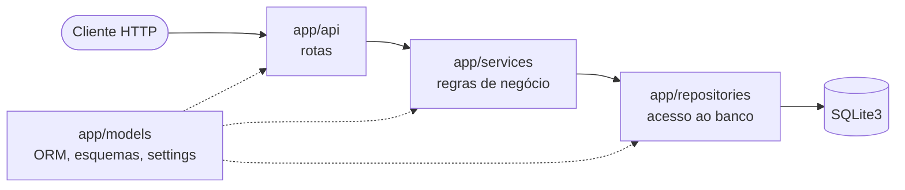

### 2. Módulos e dependências: alterado

**O que mudou:** acrescentada a aresta `task_service --> task`.

**Por quê:** o fluxo de `POST /tasks` diz que o *service* converte o esquema de entrada no objeto ORM `Task` e o entrega ao *repository*. Para isso, `task_service.py` precisa importar `task.py`. O diagrama anterior escondia essa dependência, e quem implementasse seguindo só o desenho não teria onde criar o objeto ORM sem violar as camadas.

**Antes**

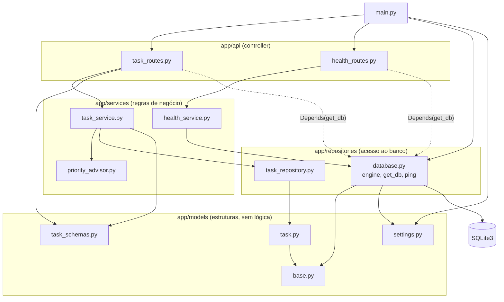

**Depois** (aresta nova em laranja)

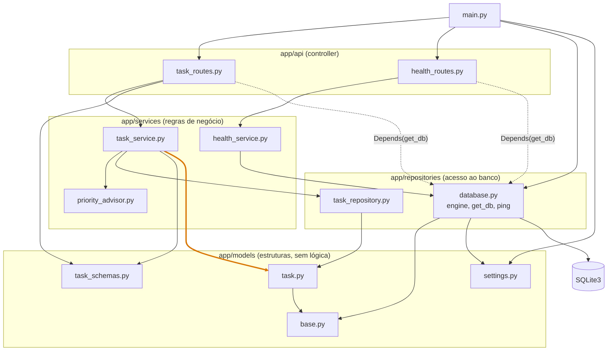

### 3. Fluxo de `POST /tasks`: alterado

**O que mudou:** a gravação passou de uma mensagem (`INSERT`) para três: `INSERT + COMMIT`, `refresh` e o retorno de `id`, `created_at` e `updated_at`.

**Por quê:** o desenho anterior não dizia quem confirma a transação nem como os valores gerados pelo banco voltam ao objeto. Sem isso, cada camada poderia supor que a outra faz o `commit`. A decisão foi registrada como **ADR-12**: o *repository* faz `commit` seguido de `refresh`; o `get_db` só abre e fecha a sessão.

**Antes**

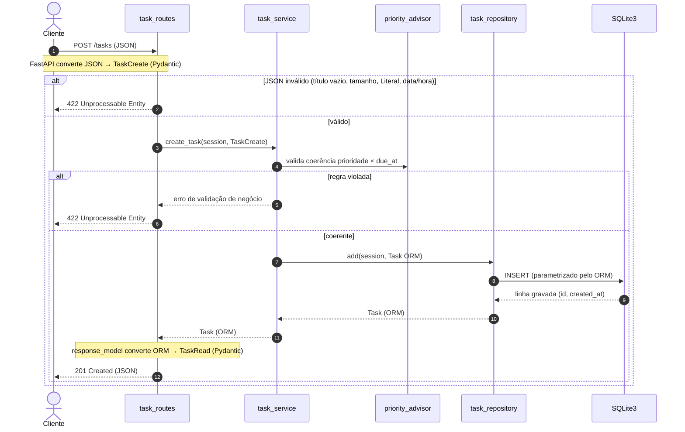

**Depois** (trecho novo na faixa laranja)

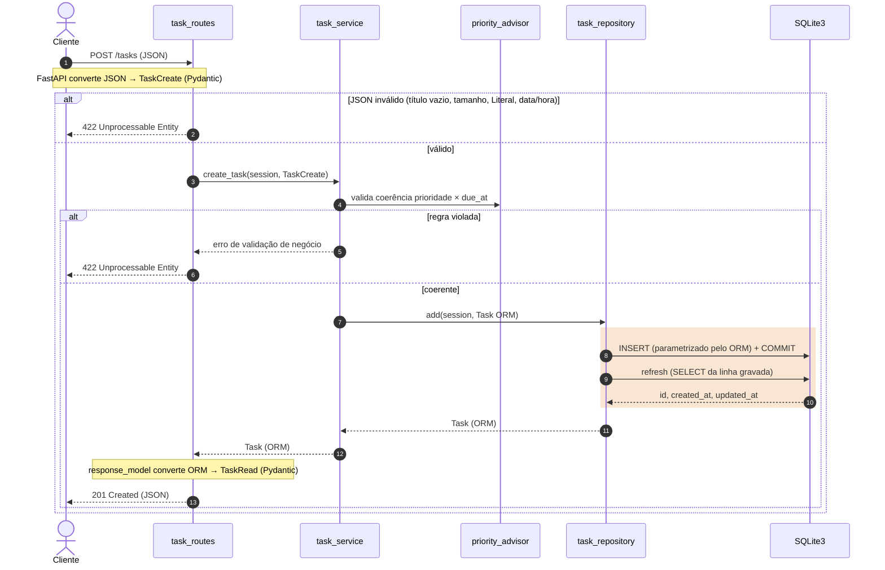

### 4. Fluxo de `GET /health`: sem alteração

O fluxo continua correto: verificação real com `SELECT 1`, 200 ou 503 e nenhum detalhe interno na resposta. O esquema Pydantic do corpo da resposta ficou como decisão D-08, para o *blueprint* da `v0.2.0`.

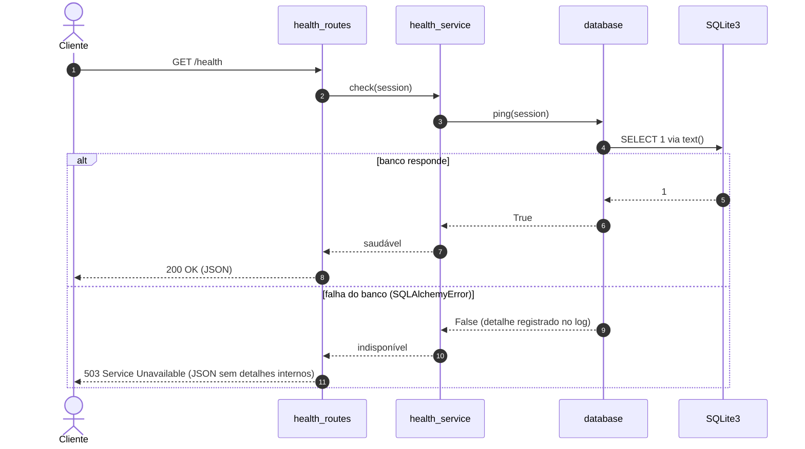

### 5. Erros em `/tasks/{id}`: novo

**Antes:** não havia diagrama. O comportamento estava só em texto, na seção "Outros códigos de resposta" de `docs/arquitetura.md`:

> - **404 Not Found:** `GET`, `PUT`, `PATCH` e `DELETE /tasks/{id}` (e a marcação como concluída) respondem 404 quando o *repository* não encontra a tarefa. O *service* sinaliza com uma exceção de domínio, e a rota a traduz para 404; o *service* não conhece códigos HTTP.
> - **500 Internal Server Error:** falha inesperada do banco em operações de tarefa responde com mensagem genérica; o detalhe vai para o log, nunca para o cliente.

**Por quê:** os três desfechos de uma operação sobre uma tarefa (existe, não existe, banco falhou) são o núcleo dos RF-04 a RF-08 e do RT-09. Vê-los lado a lado deixa claro onde está a exceção de domínio e que o 500 não expõe detalhes internos (RNF-10). O diagrama não fixa onde o erro é registrado no log; isso fica para o *blueprint* da `v0.3.0` (RT-09).

**Depois**

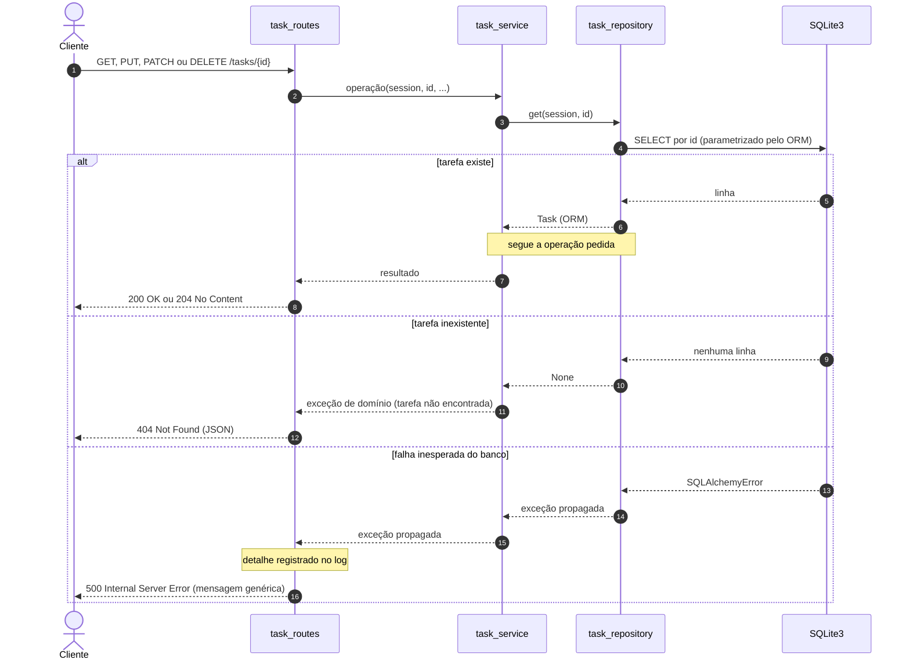

### 6. Modelo de dados: alterado

**O que mudou:** os comentários de `status` e `priority` passaram a indicar que o valor padrão está em aberto (decisões D-01 e D-04), e o texto abaixo do diagrama de origem passou a citar a seção 2.1 do escopo. A estrutura da tabela não mudou.

**Por quê:** o diagrama anterior não dizia nada sobre valores padrão, e quem o lesse poderia supor que não há. Ligar os campos às decisões evita implementar um padrão antes de ele ser aprovado.

**Antes**

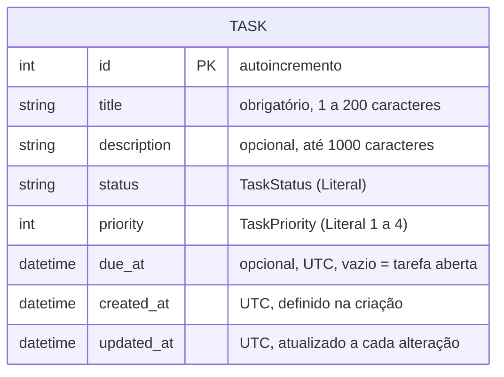

**Depois** (as mudanças estão nos comentários de `status` e `priority`; o `erDiagram` não permite destaque de cor por atributo)

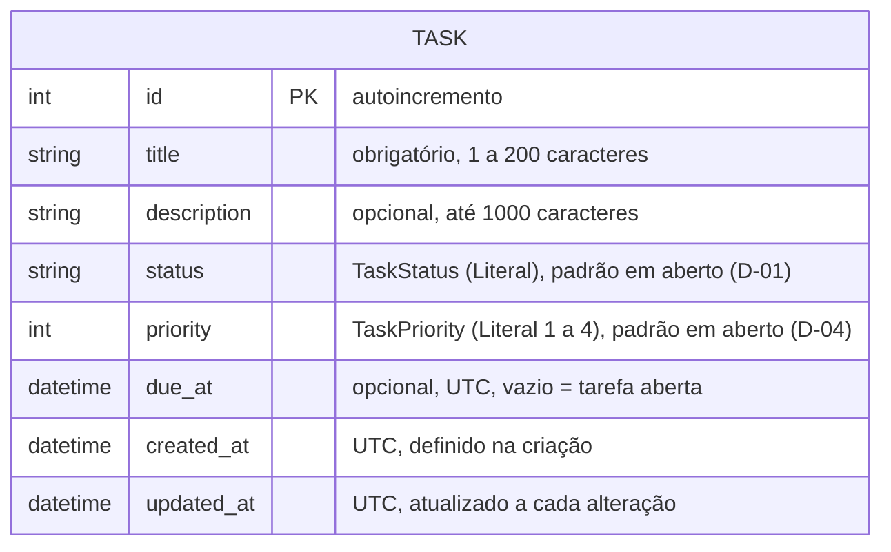

### 7. Testes: novo

**Antes:** não havia diagrama. A estratégia estava só no `CLAUDE.md` (seção Testes) e nas ADR-06 e ADR-09.

**Por quê:** mostra ao avaliador, de relance, o que cada arquivo de teste exercita e o que é substituído em cada um: o *repository* por um dublê, o banco por SQLite em memória. Apoia os itens RT-04, RT-08 e RT-10 do backlog.

**Depois**

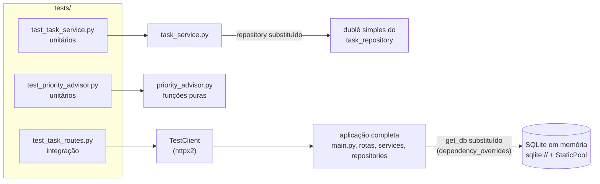

## Revisão de 05/10/2026 (Prompt 24, fechamento da `v0.2.0`)

Os diagramas foram ajustados ao código da `v0.2.0`. **Antes** é a versão do *commit* `4aa717c`; **depois** é a versão oficial atual de [`docs/arquitetura.md`](arquitetura.md), com o destaque em laranja.

| # | Diagrama | Origem | Resultado | Motivo |
| --- | --- | --- | --- | --- |
| 1 | Módulos e dependências | `arquitetura.md`, seção 2 | **alterado** | novo `health_schemas.py` (D-08, ADR-13), importado por `health_routes` e `health_service`; a seta `main → database` passa a dizer o que é importado (`create_tables` e `engine`, DT-01) |
| 2 | Fluxo de `GET /health` | `arquitetura.md`, seção 3 | **alterado** | a função do *service* chama-se `check_health`, e as respostas mostram o `HealthRead` e os corpos de `200` e `503` |

Os demais diagramas (visão em camadas, `POST /tasks`, erros em `/tasks/{id}`, modelo de dados e testes) não mudaram: descrevem código das `v0.3.0` e `v0.4.0` ou continuam corretos.

### 1. Módulos e dependências: alterado

**O que mudou:** nó `health_schemas.py` em `app/models`, arestas `health_routes --> health_schemas` e `health_service --> health_schemas`, e rótulo `create_tables, engine` na aresta `main --> database`.

**Antes**

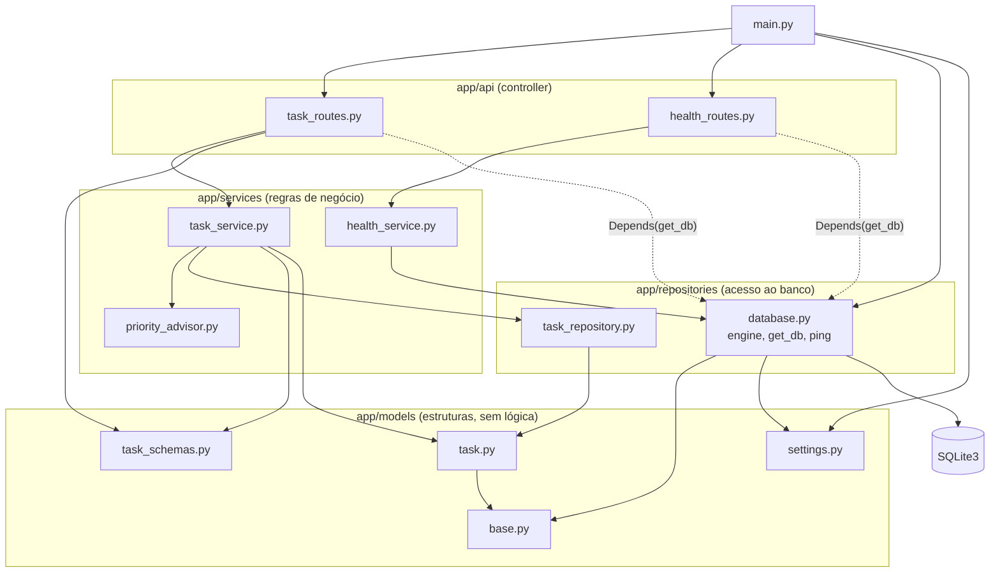

**Depois**

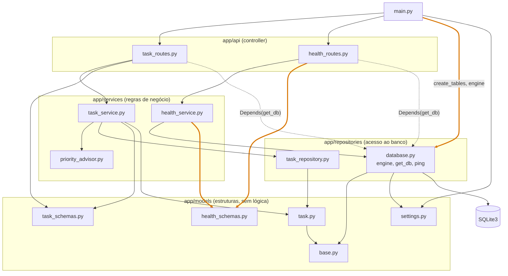

### 2. Fluxo de `GET /health`: alterado

**O que mudou:** `check(session)` passa a `check_health(session)`; as mensagens "saudável" e "indisponível" passam a mostrar o `HealthRead` devolvido, e as respostas HTTP mostram o corpo da D-08.

**Antes**


**Depois**

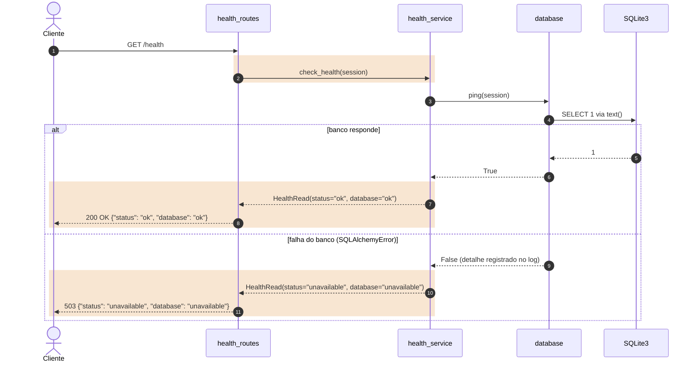

## Revisão de 06/10/2026 (Prompt 31, fechamento da `v0.3.0`)

Os diagramas foram ajustados ao código da `v0.3.0` (CRUD de tarefas). **Antes** é a versão do *commit* `d4c41bb` (`main` depois da `v0.2.0`); **depois** é a versão oficial atual de [`docs/arquitetura.md`](arquitetura.md), com o destaque em laranja.

| # | Diagrama | Origem | Resultado | Motivo |
| --- | --- | --- | --- | --- |
| 1 | Módulos e dependências | `arquitetura.md`, seção 2 | **alterado** | novo `error_handlers.py` (ADR-15), registrado por `main`; importações reais `task_service → base` (`utc_now`, DT-06), `task_repository → task_schemas` e `task → task_schemas`; `priority_advisor` marcado como `v0.4.0`, com seta pontilhada |
| 2 | Fluxo de `POST /tasks` | `arquitetura.md`, seção 3 | **alterado** | `create_task(TaskCreate)` e `add(Task)` sem `session` (ADR-14); instante único de criação (DT-06); conversão por `TaskRead.model_validate`; `422 Unprocessable Content`, a frase de *status* atual do Starlette; `priority_advisor` marcado como `v0.4.0` |
| 3 | Erros em `/tasks/{id}` | `arquitetura.md`, seção 3 | **alterado** | inclui `POST /tasks/{id}/complete`; chamadas sem `session` (ADR-14); o `404` e o `500` passam pelo tradutor `error_handlers`, com os corpos do ADR-15 |
| 4 | Modelo de dados | `arquitetura.md`, seção 4 | **alterado** | `status` e `priority` sem "padrão em aberto": `pending` (D-01) e `3` (D-04) |
| 5 | Testes | `arquitetura.md`, seção 5 | **alterado** | dublê nomeado (`InMemoryTaskRepository`, DT-07) e injetado (ADR-14); `test_task_routes.py` também testa `Task` e `TaskRepository` com `Session` direta (DT-08) |

Os demais diagramas (visão em camadas, no README, e `GET /health`) não mudaram: continuam corretos.

### 1. Módulos e dependências: alterado

**O que mudou:** nó `error_handlers.py` em `app/api`, com as arestas `main → error_handlers` e `error_handlers → task_service`; arestas `task_service → base`, `task_repository → task_schemas` e `task → task_schemas`; a aresta `task_service → priority_advisor` passa a pontilhada, e o nó indica `v0.4.0`. O nó `base.py` passa a listar `UTCDateTime` e `utc_now` (DT-04).

**Antes**

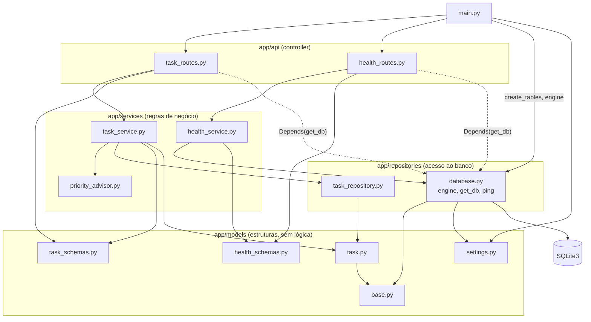

**Depois**

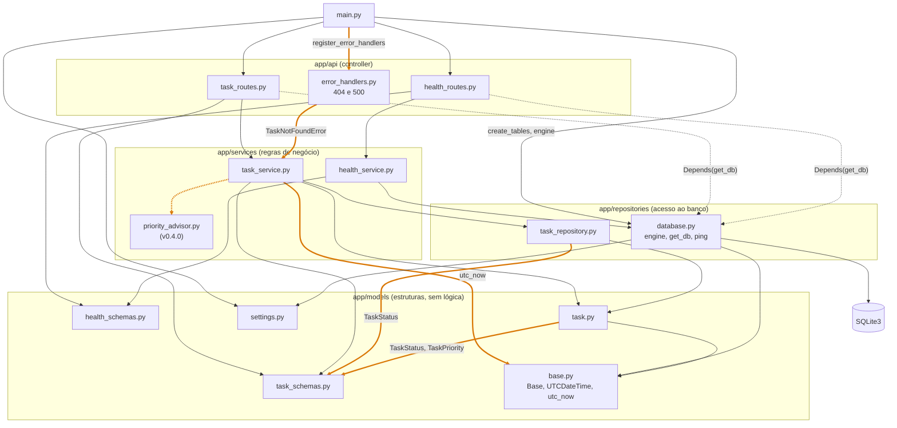

### 2. Fluxo de `POST /tasks`: alterado

**O que mudou:** o participante `priority_advisor` indica `v0.4.0`; dentro da faixa, a validação lista data/hora sem fuso e campo extra, o `422` usa a frase atual, as chamadas não levam `session`, o *service* define o instante da criação, e a rota converte com `TaskRead.model_validate`.

**Antes**

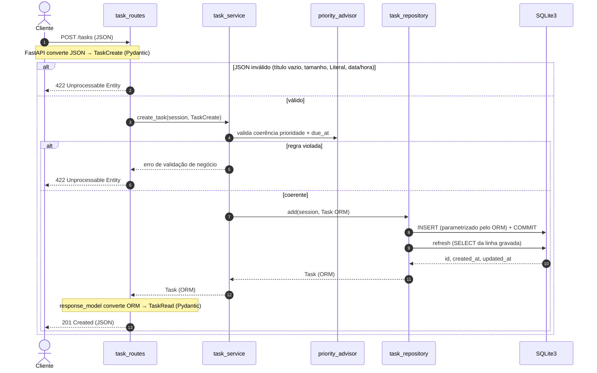

**Depois**

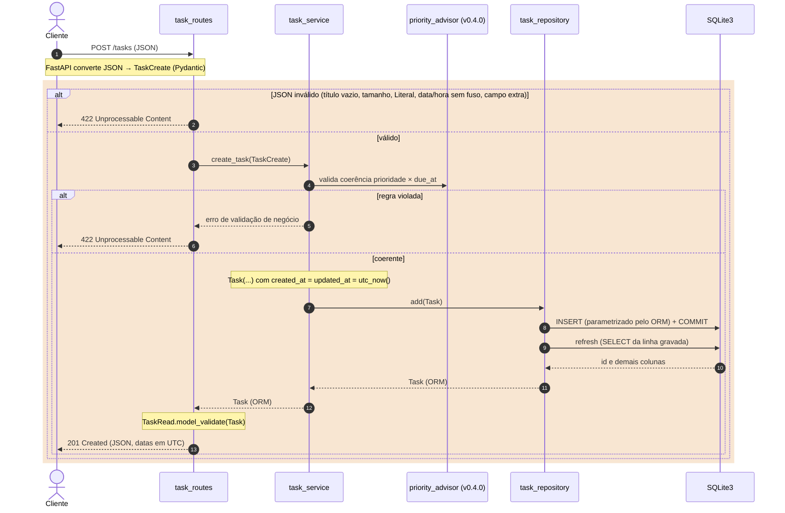

### 3. Erros em `/tasks/{id}`: alterado

**O que mudou:** novo participante `error_handlers`; a requisição inclui `POST /tasks/{id}/complete`; as chamadas não levam `session`; o `404` e o `500` são respondidos pelo tradutor, com os corpos fixos.

**Antes**


**Depois**

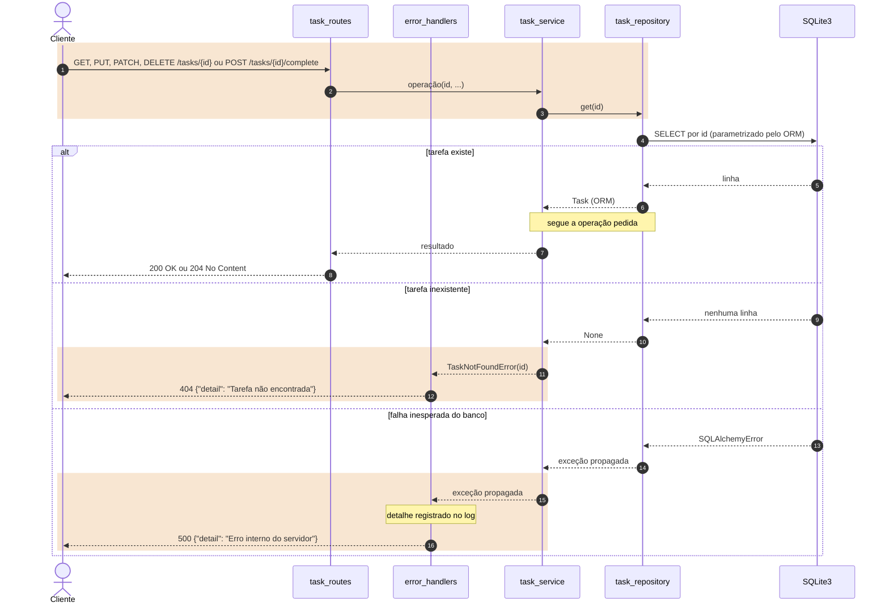

### 4. Modelo de dados: alterado

**O que mudou:** os comentários de `status` (`pending` ou `done`, padrão `pending`) e de `priority` (1 a 4, padrão 3). Diagramas de entidade não aceitam destaque de linha; a mudança está só nesses dois atributos.

**Antes**

```mermaid
erDiagram
    TASK {
        int id PK "autoincremento"
        string title "obrigatório, 1 a 200 caracteres"
        string description "opcional, até 1000 caracteres"
        string status "TaskStatus (Literal), padrão em aberto (D-01)"
        int priority "TaskPriority (Literal 1 a 4), padrão em aberto (D-04)"
        datetime due_at "opcional, UTC, vazio = tarefa aberta"
        datetime created_at "UTC, definido na criação"
        datetime updated_at "UTC, atualizado a cada alteração"
    }
```

**Depois**

```mermaid
erDiagram
    TASK {
        int id PK "autoincremento"
        string title "obrigatório, 1 a 200 caracteres"
        string description "opcional, até 1000 caracteres"
        string status "TaskStatus: pending ou done, padrão pending (D-01)"
        int priority "TaskPriority: 1 a 4, padrão 3 (D-03, D-04)"
        datetime due_at "opcional, UTC, vazio = tarefa aberta"
        datetime created_at "UTC, definido na criação"
        datetime updated_at "UTC, atualizado a cada alteração"
    }
```

### 5. Testes: alterado

**O que mudou:** o nó do dublê passa a `InMemoryTaskRepository`, e a aresta a "repository injetado"; novo nó `Task e TaskRepository com Session direta`, ligado a `test_task_routes.py` e ao banco em memória.

**Antes**

```mermaid
flowchart LR
    subgraph tests["tests/"]
        t_service["test_task_service.py<br/>unitários"]
        t_advisor["test_priority_advisor.py<br/>unitários"]
        t_routes["test_task_routes.py<br/>integração"]
    end

    task_service["task_service.py"]
    double["dublê simples do<br/>task_repository"]
    priority_advisor["priority_advisor.py<br/>funções puras"]
    client["TestClient<br/>(httpx2)"]
    app["aplicação completa<br/>main.py, rotas, services, repositories"]
    mem[("SQLite em memória<br/>sqlite:// + StaticPool")]

    t_service --> task_service
    task_service -->|"repository substituído"| double
    t_advisor --> priority_advisor
    t_routes --> client
    client --> app
    app -->|"get_db substituído<br/>(dependency_overrides)"| mem
```

**Depois**

```mermaid
flowchart LR
    subgraph tests["tests/"]
        t_service["test_task_service.py<br/>unitários"]
        t_advisor["test_priority_advisor.py<br/>unitários"]
        t_routes["test_task_routes.py<br/>integração"]
    end

    task_service["task_service.py"]
    double["InMemoryTaskRepository<br/>dublê do TaskStore"]
    priority_advisor["priority_advisor.py<br/>funções puras"]
    client["TestClient<br/>(httpx2)"]
    app["aplicação completa<br/>main.py, rotas, services, repositories"]
    persistence["Task e TaskRepository<br/>com Session direta"]
    mem[("SQLite em memória<br/>sqlite:// + StaticPool")]

    t_service --> task_service
    task_service -->|"repository injetado"| double
    t_advisor --> priority_advisor
    t_routes --> client
    client --> app
    app -->|"get_db substituído<br/>(dependency_overrides)"| mem
    t_routes --> persistence
    persistence --> mem

    linkStyle 1,6,7 stroke:#d97706,stroke-width:3px
```

## Revisão de 06/10/2026 (Prompt 35, fechamento da `v0.4.0`)

Os diagramas foram ajustados ao código da `v0.4.0` (prioridades, `priority_advisor` e datas no horário local). **Antes** é a versão do *commit* `649d8e4` (`main` depois da `v0.3.0`); **depois** é a versão oficial atual de [`docs/arquitetura.md`](arquitetura.md), com o destaque em laranja.

| # | Diagrama | Origem | Resultado | Motivo |
| --- | --- | --- | --- | --- |
| 1 | Módulos e dependências | `arquitetura.md`, seção 2 | **alterado** | `priority_advisor` implementado (ADR-16): seta sólida `task_service → priority_advisor` e novas arestas `priority_advisor → task_schemas`, `error_handlers → priority_advisor` (`IncoherentPriorityError`, ADR-17) e `task_routes → settings` (`Settings`, DT-15); `task_repository` passa a usar `TaskPriority` (RF-14) |
| 2 | Fluxo de `POST /tasks` | `arquitetura.md`, seção 3 | **alterado** | coerência por `ensure_priority_is_coherent` com o `422` pelo `error_handlers` (D-05, ADR-17); fuso local na entrada (ADR-18); resposta montada por `build_task_read`, com `suggest_priority` e as datas no fuso local (DT-11) |
| 3 | Modelo de dados | `arquitetura.md`, seção 4 | **alterado** | `priority` com a regra da D-05; datas em UTC no banco e no fuso local na API (ADR-18) |

Os demais diagramas (visão em camadas, no README, `GET /health`, erros em `/tasks/{id}` e testes) não mudaram: continuam corretos. O texto da seção de erros passa a citar o `422` de coerência em `PUT` e `PATCH`, e o da seção de testes, a contagem da `v0.4.0`.

### 1. Módulos e dependências: alterado

**O que mudou:** o nó `priority_advisor.py` deixa de indicar `v0.4.0` e passa a "funções puras"; a aresta `task_service → priority_advisor` passa a sólida, com as funções chamadas; novas arestas `task_routes → settings`, `error_handlers → priority_advisor` e `priority_advisor → task_schemas`; a aresta `task_repository → task_schemas` passa a listar `TaskPriority`. O nó `error_handlers.py` passa a "404, 422 e 500".

**Antes**

```mermaid
flowchart TD
    main["main.py"]

    subgraph api["app/api (controller)"]
        task_routes["task_routes.py"]
        health_routes["health_routes.py"]
        error_handlers["error_handlers.py<br/>404 e 500"]
    end

    subgraph services["app/services (regras de negócio)"]
        task_service["task_service.py"]
        priority_advisor["priority_advisor.py<br/>(v0.4.0)"]
        health_service["health_service.py"]
    end

    subgraph repositories["app/repositories (acesso ao banco)"]
        task_repository["task_repository.py"]
        database["database.py<br/>engine, get_db, ping"]
    end

    subgraph models["app/models (estruturas, sem lógica)"]
        task_schemas["task_schemas.py"]
        health_schemas["health_schemas.py"]
        task["task.py"]
        base["base.py<br/>Base, UTCDateTime, utc_now"]
        settings["settings.py"]
    end

    db[("SQLite3")]

    main --> task_routes
    main --> health_routes
    main -->|"create_tables, engine"| database
    main --> settings
    main -->|"register_error_handlers"| error_handlers

    task_routes --> task_service
    task_routes --> task_schemas
    health_routes --> health_service
    health_routes --> health_schemas
    task_routes -.->|"Depends(get_db)"| database
    health_routes -.->|"Depends(get_db)"| database
    error_handlers -->|"TaskNotFoundError"| task_service

    task_service -.-> priority_advisor
    task_service --> task_repository
    task_service --> task_schemas
    task_service --> task
    task_service -->|"utc_now"| base
    health_service --> database
    health_service --> health_schemas

    task_repository --> task
    task_repository -->|"TaskStatus"| task_schemas
    database --> base
    database --> settings
    task --> base
    task -->|"TaskStatus, TaskPriority"| task_schemas

    database --> db
```

**Depois**

```mermaid
flowchart TD
    main["main.py"]

    subgraph api["app/api (controller)"]
        task_routes["task_routes.py"]
        health_routes["health_routes.py"]
        error_handlers["error_handlers.py<br/>404, 422 e 500"]
    end

    subgraph services["app/services (regras de negócio)"]
        task_service["task_service.py"]
        priority_advisor["priority_advisor.py<br/>funções puras"]
        health_service["health_service.py"]
    end

    subgraph repositories["app/repositories (acesso ao banco)"]
        task_repository["task_repository.py"]
        database["database.py<br/>engine, get_db, ping"]
    end

    subgraph models["app/models (estruturas, sem lógica)"]
        task_schemas["task_schemas.py"]
        health_schemas["health_schemas.py"]
        task["task.py"]
        base["base.py<br/>Base, UTCDateTime, utc_now"]
        settings["settings.py"]
    end

    db[("SQLite3")]

    main --> task_routes
    main --> health_routes
    main -->|"create_tables, engine"| database
    main --> settings
    main -->|"register_error_handlers"| error_handlers

    task_routes --> task_service
    task_routes --> task_schemas
    task_routes -->|"Settings"| settings
    health_routes --> health_service
    health_routes --> health_schemas
    task_routes -.->|"Depends(get_db)"| database
    health_routes -.->|"Depends(get_db)"| database
    error_handlers -->|"TaskNotFoundError"| task_service
    error_handlers -->|"IncoherentPriorityError"| priority_advisor

    task_service -->|"ensure_priority_is_coherent, suggest_priority"| priority_advisor
    task_service --> task_repository
    task_service --> task_schemas
    task_service --> task
    task_service -->|"utc_now"| base
    priority_advisor -->|"TaskPriority, TaskStatus"| task_schemas
    health_service --> database
    health_service --> health_schemas

    task_repository --> task
    task_repository -->|"TaskStatus, TaskPriority"| task_schemas
    database --> base
    database --> settings
    task --> base
    task -->|"TaskStatus, TaskPriority"| task_schemas

    database --> db

    linkStyle 7,13,14,19,23 stroke:#d97706,stroke-width:3px
```

### 2. Fluxo de `POST /tasks`: alterado

**O que mudou:** novo participante `error_handlers`; o `priority_advisor` deixa de indicar `v0.4.0`. Dentro da faixa: os formatos de `due_at` aceitos; a coerência por `ensure_priority_is_coherent`, com a exceção traduzida em `422` com texto fixo; o fuso local acrescentado a `due_at`; e a resposta montada por `build_task_read`, com `suggest_priority` e as datas no fuso local.

**Antes**

```mermaid
sequenceDiagram
    autonumber
    actor C as Cliente
    participant R as task_routes
    participant S as task_service
    participant A as priority_advisor (v0.4.0)
    participant Rep as task_repository
    participant DB as SQLite3

    C->>R: POST /tasks (JSON)
    Note over C,R: FastAPI converte JSON → TaskCreate (Pydantic)
    alt JSON inválido (título vazio, tamanho, Literal, data/hora sem fuso, campo extra)
        R-->>C: 422 Unprocessable Content
    else válido
        R->>S: create_task(TaskCreate)
        S->>A: valida coerência prioridade × due_at
        alt regra violada
            S-->>R: erro de validação de negócio
            R-->>C: 422 Unprocessable Content
        else coerente
            Note over S: Task(...) com created_at = updated_at = utc_now()
            S->>Rep: add(Task)
            Rep->>DB: INSERT (parametrizado pelo ORM) + COMMIT
            Rep->>DB: refresh (SELECT da linha gravada)
            DB-->>Rep: id e demais colunas
            Rep-->>S: Task (ORM)
            S-->>R: Task (ORM)
            Note over R: TaskRead.model_validate(Task)
            R-->>C: 201 Created (JSON, datas em UTC)
        end
    end
```

**Depois**

```mermaid
sequenceDiagram
    autonumber
    actor C as Cliente
    participant R as task_routes
    participant E as error_handlers
    participant S as task_service
    participant A as priority_advisor
    participant Rep as task_repository
    participant DB as SQLite3

    C->>R: POST /tasks (JSON)
    rect rgba(217, 119, 6, 0.18)
        Note over C,R: FastAPI converte JSON → TaskCreate (Pydantic)<br/>due_at em DD/MM/AAAA HH:MM, DD/MM/AAAA (23:59) ou ISO com fuso
        alt JSON inválido (título vazio, tamanho, Literal, formato de due_at, campo extra)
            R-->>C: 422 Unprocessable Content (lista de erros)
        else válido
            R->>S: create_task(TaskCreate)
            S->>A: ensure_priority_is_coherent(priority, due_at)
            alt prioridade 4 sem due_at
                A-->>S: IncoherentPriorityError
                S-->>E: exceção propagada
                E-->>C: 422 {"detail": "Prioridade 4 (agendada) exige due_at preenchido"}
            else coerente
                Note over S: due_at sem fuso recebe o fuso local (LOCAL_UTC_OFFSET)<br/>created_at = updated_at = utc_now()
                S->>Rep: add(Task)
                Rep->>DB: INSERT (parametrizado pelo ORM) + COMMIT
                Rep->>DB: refresh (SELECT da linha gravada)
                DB-->>Rep: id e demais colunas (datas em UTC)
                Rep-->>S: Task (ORM)
                S-->>R: Task (ORM)
                R->>S: build_task_read(Task)
                S->>A: suggest_priority(status, due_at, clock())
                A-->>S: prioridade sugerida ou None
                Note over S: TaskRead com suggested_priority e datas no fuso local
                S-->>R: TaskRead
                R-->>C: 201 Created (JSON, datas no fuso local)
            end
        end
    end
```

### 3. Modelo de dados: alterado

**O que mudou:** o comentário de `priority` (prioridade 4 exige `due_at`) e os de `due_at`, `created_at` e `updated_at` (UTC no banco, fuso local na API). Diagramas de entidade não aceitam destaque de linha; a mudança está só nesses quatro atributos.

**Antes**

```mermaid
erDiagram
    TASK {
        int id PK "autoincremento"
        string title "obrigatório, 1 a 200 caracteres"
        string description "opcional, até 1000 caracteres"
        string status "TaskStatus: pending ou done, padrão pending (D-01)"
        int priority "TaskPriority: 1 a 4, padrão 3 (D-03, D-04)"
        datetime due_at "opcional, UTC, vazio = tarefa aberta"
        datetime created_at "UTC, definido na criação"
        datetime updated_at "UTC, atualizado a cada alteração"
    }
```

**Depois**

```mermaid
erDiagram
    TASK {
        int id PK "autoincremento"
        string title "obrigatório, 1 a 200 caracteres"
        string description "opcional, até 1000 caracteres"
        string status "TaskStatus: pending ou done, padrão pending (D-01)"
        int priority "TaskPriority: 1 a 4, padrão 3 (D-03, D-04), 4 exige due_at (D-05)"
        datetime due_at "opcional, UTC no banco e fuso local na API, vazio = tarefa aberta"
        datetime created_at "UTC no banco e fuso local na API, definido na criação"
        datetime updated_at "UTC no banco e fuso local na API, atualizado a cada alteração"
    }
```
